# LavaFácil

## Modelo Conceptual

### Lista de Conceptos Candidatos
- Cliente
- Empleado
- Usuario autenticado
- Tipo de documento
- Vehículo
- Tipo de vehículo
- Clave de asociación de vehículo
- Servicio
- Tipo de servicio
- Etapa de servicio
- Paquete de servicios
- Lavado
- Servicio en lavado
- Etapa en lavado
- Pago
- Detalle de pago
- Configuración del sistema
- Horario de operación
- Sesión de WhatsApp
- Mensaje de WhatsApp
- Registro de auditoría

### Lista de Conceptos Idóneos
- Cliente
- Empleado
- TipoDocumento
- Vehículo
- TipoVehiculo
- Servicio
- TipoServicio
- Etapa
- PaqueteServicio
- Lavado
- ServicioEnLavado
- EtapaEnLavado
- PagoLavado
- DetallePago
- Configuracion
- WhatsAppSession
- AuditLog

### Descripción del Concepto
| Concepto | Descripción |
|---|---|
| Cliente | Persona que contrata servicios del lavadero y puede tener uno o varios vehículos asociados. |
| Empleado | Usuario interno que opera el sistema y ejecuta lavados según rol y disponibilidad. |
| TipoDocumento | Catálogo de tipos de documento válidos para identificar clientes. |
| Vehículo | Unidad a lavar, asociable a uno o varios clientes mediante clave de asociación. Incluye referencia al nombre completo del dueño principal para visualización operativa. |
| TipoVehiculo | Clasificación del vehículo con formato de patente y cantidad de empleados requeridos. |
| Servicio | Prestación individual ofrecida por el lavadero con precio, tiempo estimado y etapas opcionales. |
| TipoServicio | Categoría funcional de los servicios para controlar combinaciones y filtros. |
| Etapa | Paso interno de un servicio que define progresión operativa. |
| PaqueteServicio | Conjunto de servicios con reglas de compatibilidad y descuento. |
| Lavado | Ejecución concreta de servicios sobre un vehículo, con estados operativos, de pago y retiro. |
| ServicioEnLavado | Instancia de servicio dentro de un lavado, con estado propio y orden de ejecución. |
| EtapaEnLavado | Instancia de etapa dentro de un servicio en lavado, con trazabilidad temporal. |
| PagoLavado | Estado financiero agregado del lavado (pendiente, parcial, pagado o cancelado). |
| DetallePago | Movimiento individual de cobro con medio, monto, fecha y notas. |
| Configuracion | Parámetros globales de operación (horarios, capacidad, sesiones, tolerancias y datos del lavadero). |
| WhatsAppSession | Estado conversacional por número de teléfono para registro y autogestión de cliente. |
| AuditLog | Registro de acciones relevantes para trazabilidad operativa y seguridad. |

### Relaciones entre los conceptos
- Un **Cliente** se relaciona con uno o varios **Vehículo**.
- Un **Vehículo** puede pertenecer a varios **Cliente** (múltiples dueños).
- Un **Vehículo** pertenece a un **TipoVehiculo**.
- Un **Servicio** pertenece a un **TipoServicio** y a un **TipoVehiculo**.
- Un **Servicio** puede contener cero o más **Etapa**.
- Un **PaqueteServicio** contiene dos o más **Servicio** compatibles.
- Un **Lavado** se registra para un **Cliente** y un **Vehículo**.
- Un **Lavado** contiene uno o más **ServicioEnLavado**.
- Un **ServicioEnLavado** puede contener cero o más **EtapaEnLavado**.
- Un **Lavado** contiene un único **PagoLavado** con múltiples **DetallePago**.
- Una **WhatsAppSession** puede asociarse a un **Cliente** autenticado por teléfono.
- Un **AuditLog** referencia la acción de un **Empleado** sobre una entidad del dominio.
- **Configuracion** regula reglas transversales de **Lavado**, sesión y operación.

### Descripción de los Atributos
| Concepto | Atributos relevantes |
|---|---|
| Cliente | Id, TipoDocumento, NumeroDocumento, Nombre, Apellido, Telefono, Email, VehiculosIds, Estado |
| Empleado | Id, NombreCompleto, Email, Rol, Estado |
| TipoDocumento | Id, Nombre, Formato |
| Vehículo | Id, Patente, TipoVehiculo, Marca, Modelo, Color, ClienteId, ClienteNombreCompleto, ClientesIds, ClaveAsociacionHash, Estado |
| TipoVehiculo | Id, Nombre, FormatoPatente, CantidadEmpleadosRequeridos |
| Servicio | Id, Nombre, Precio, Tipo, TipoVehiculo, TiempoEstimado, Descripcion, Estado, Etapas |
| TipoServicio | Id, Nombre |
| Etapa | Id, Nombre |
| PaqueteServicio | Id, Nombre, Estado, PorcentajeDescuento, TipoVehiculo, ServiciosIds |
| Lavado | Id, Estado, ClienteId, ClienteNombre, VehiculoId, VehiculoPatente, TipoVehiculo, Servicios, PrecioOriginal, Precio, Descuento, Pago, EmpleadosAsignadosIds, EmpleadosAsignadosNombres, TiempoEstimado, TiempoInicio, TiempoFinalizacion, FechaCreacion, MotivoCancelacion, Notas, EstadoRetiro, ClienteTrajoId, ClienteRetiraId, FechaRetiro |
| ServicioEnLavado | ServicioId, ServicioNombre, TipoServicio, Precio, TiempoEstimado, Estado, Orden, TiempoInicio, TiempoFinalizacion, MotivoCancelacion, Etapas, PaqueteId, PaqueteNombre |
| EtapaEnLavado | EtapaId, Nombre, Estado, TiempoInicio, TiempoFinalizacion, MotivoCancelacion |
| PagoLavado | Estado, MontoPagado, Pagos |
| DetallePago | Id, Monto, MedioPago, Fecha, Notas |
| Configuracion | Id, HorariosOperacion, CapacidadMaximaConcurrente, EmpleadosMaximosPorLavado, TiempoNotificacionMinutos, TiempoToleranciaMinutos, IntervaloPreguntas, SesionDuracionHoras, SesionInactividadMinutos, NombreLavadero, Ubicacion, PaquetesDescuentoStep, FechaActualizacion, ActualizadoPor |
| WhatsAppSession | Id, ClienteId, CurrentState, TemporaryData, LastInteraction, CreatedAt |
| AuditLog | UserId, UserEmail, Action, TargetId, TargetType, Timestamp |

### Diagrama Conceptual
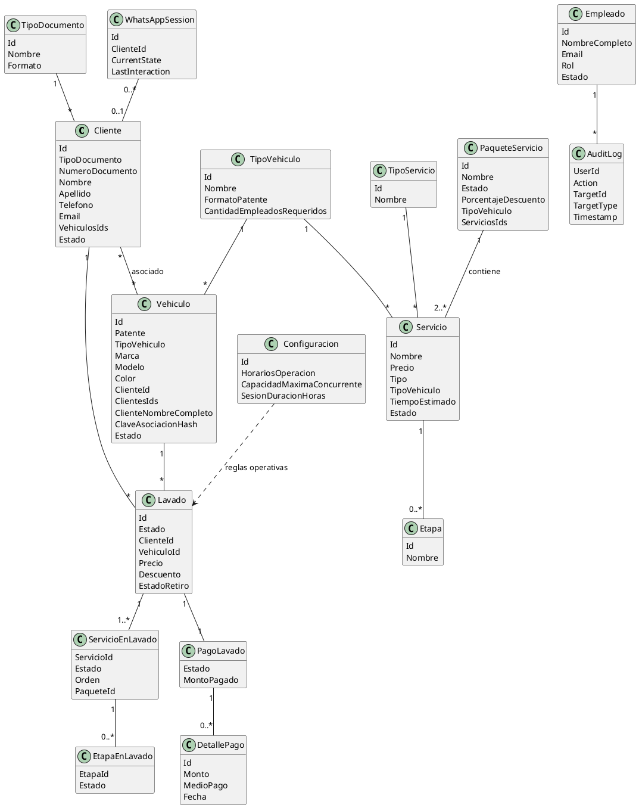

## Comportamiento del Sistema
### Diagrama de Secuencias a Nivel de Sistema (uno por cada caso de uso)
#### CU-001 - Iniciar Sesión


#### CU-001.1 - Iniciar sesión con correo y contraseña
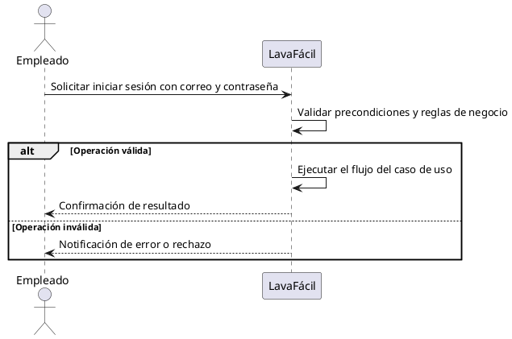

#### CU-001.2 - Iniciar sesión con Google
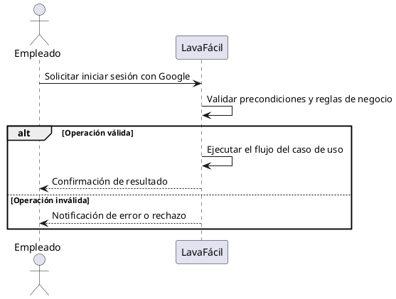

#### CU-002 - Cerrar sesión
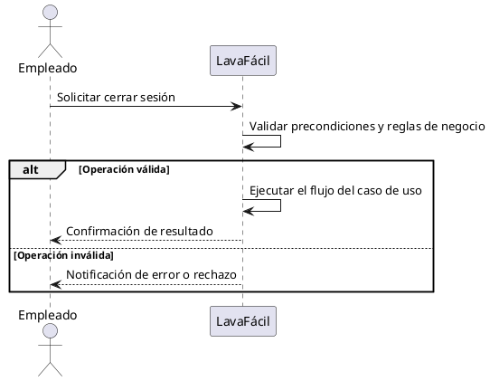

#### CU-003 - Recuperar contraseña


#### CU-004 - Cierre de sesión automático por inactividad
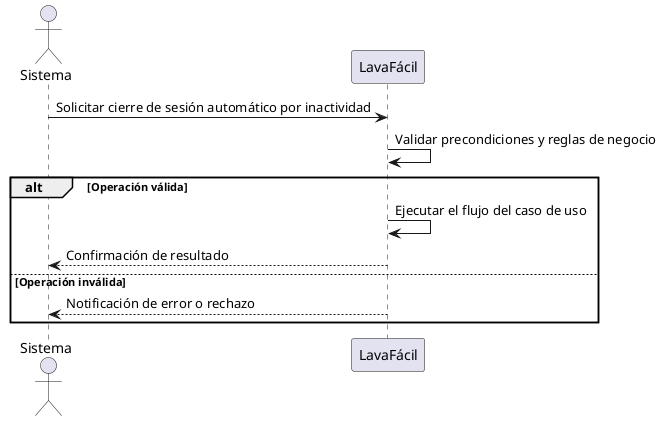

#### CU-005 - Registrarse en el sistema
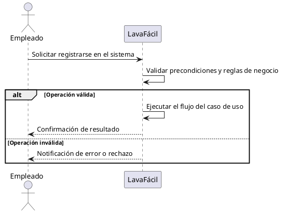

#### CU-005.1 - Registrarse por correo
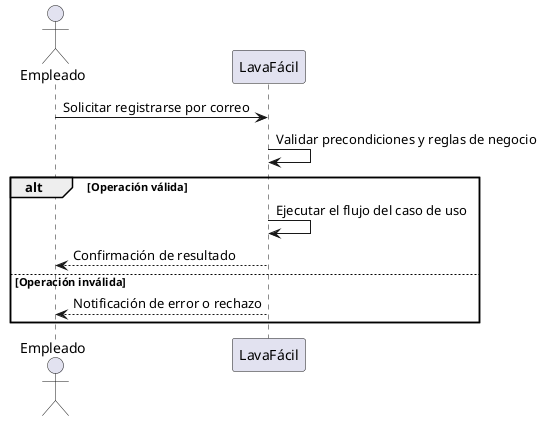

#### CU-005.2 - Registrarse por Google


#### CU-006 - Modificar empleado
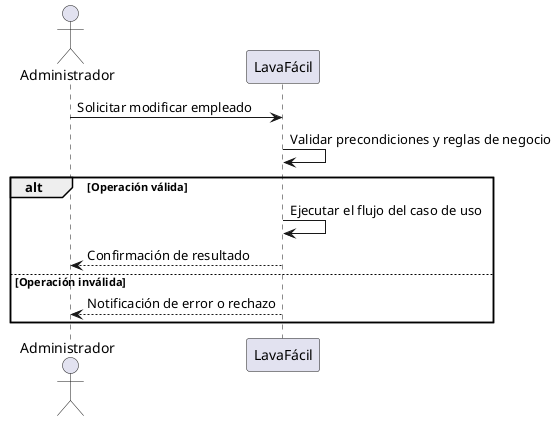

#### CU-007 - Desactivar empleado


#### CU-008 - Reactivar empleado


#### CU-009 - Consultar empleados
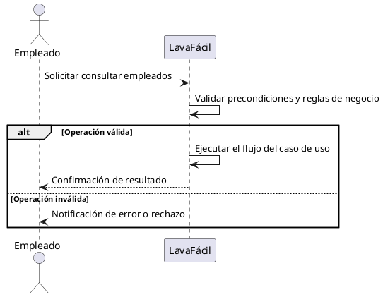

#### CU-010 - Asignar roles a empleados
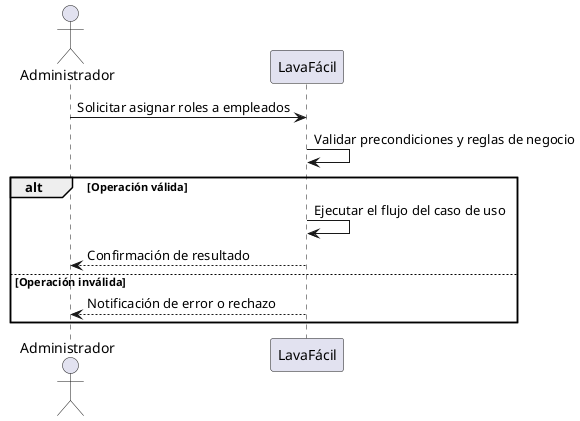

#### CU-011 - Autenticar usuario con Google y registrar perfil si es nuevo
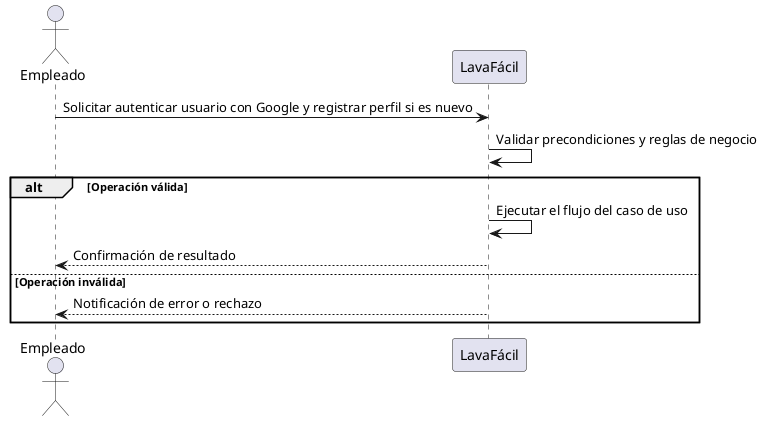

#### CU-012 - Crear cliente
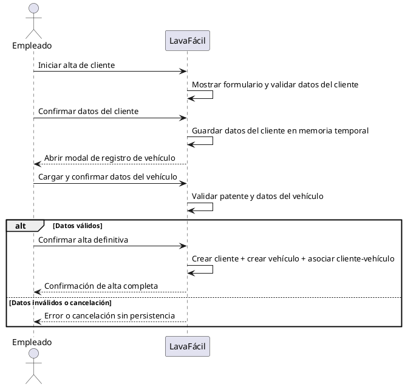

#### CU-013 - Modificar cliente
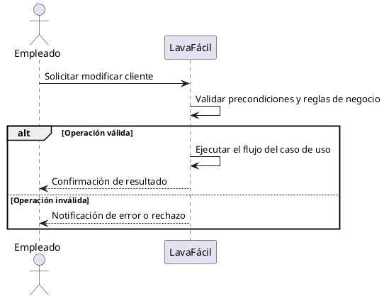

#### CU-014 - Desactivar cliente


#### CU-015 - Reactivar cliente


#### CU-016 - Consultar clientes
```plantuml
@startuml
actor "Empleado" as Actor
participant "LavaFácil" as Sistema

Actor -> Sistema: Solicitar consultar clientes
Sistema -> Sistema: Validar precondiciones y reglas de negocio
alt Operación válida
  Sistema -> Sistema: Ejecutar el flujo del caso de uso
  Sistema --> Actor: Confirmación de resultado
else Operación inválida
  Sistema --> Actor: Notificación de error o rechazo
end
@enduml
```

#### CU-017 - Buscar clientes
```plantuml
@startuml
actor "Empleado" as Actor
participant "LavaFácil" as Sistema

Actor -> Sistema: Solicitar buscar clientes
Sistema -> Sistema: Validar precondiciones y reglas de negocio
alt Operación válida
  Sistema -> Sistema: Ejecutar el flujo del caso de uso
  Sistema --> Actor: Confirmación de resultado
else Operación inválida
  Sistema --> Actor: Notificación de error o rechazo
end
@enduml
```

#### CU-018 - Crear vehículo
```plantuml
@startuml
actor "Empleado" as Actor
participant "LavaFácil" as Sistema

Actor -> Sistema: Abrir modal "Nuevo Vehículo" desde flujo de cliente
Sistema -> Sistema: Cargar tipos de vehículo y ayudas de marca/modelo
Actor -> Sistema: Confirmar datos del vehículo
Sistema -> Sistema: Validar patente y reglas de negocio
alt Contexto edición de cliente
  Sistema -> Sistema: Crear vehículo y asociarlo al cliente existente
  Sistema --> Actor: Confirmación de alta y asociación
else Contexto alta de cliente nuevo
  Sistema -> Sistema: Guardar vehículo en estado pendiente del alta conjunta
  Sistema --> Actor: Confirmación en memoria hasta finalizar CU-012
end
@enduml
```

#### CU-019 - Modificar vehículo
```plantuml
@startuml
actor "Empleado" as Actor
participant "LavaFácil" as Sistema

Actor -> Sistema: Solicitar modificar vehículo
Sistema -> Sistema: Validar precondiciones y reglas de negocio
alt Operación válida
  Sistema -> Sistema: Ejecutar el flujo del caso de uso
  Sistema --> Actor: Confirmación de resultado
else Operación inválida
  Sistema --> Actor: Notificación de error o rechazo
end
@enduml
```

#### CU-020 - Desactivar vehículo
```plantuml
@startuml
actor "Empleado" as Actor
participant "LavaFácil" as Sistema

Actor -> Sistema: Solicitar desactivar vehículo
Sistema -> Sistema: Validar precondiciones y reglas de negocio
alt Operación válida
  Sistema -> Sistema: Ejecutar el flujo del caso de uso
  Sistema --> Actor: Confirmación de resultado
else Operación inválida
  Sistema --> Actor: Notificación de error o rechazo
end
@enduml
```

#### CU-021 - Consultar vehículos
```plantuml
@startuml
actor "Empleado" as Actor
participant "LavaFácil" as Sistema

Actor -> Sistema: Solicitar consultar vehículos
Sistema -> Sistema: Validar precondiciones y reglas de negocio
alt Operación válida
  Sistema -> Sistema: Ejecutar el flujo del caso de uso
  Sistema --> Actor: Confirmación de resultado
else Operación inválida
  Sistema --> Actor: Notificación de error o rechazo
end
@enduml
```

#### CU-022 - Buscar vehículos
```plantuml
@startuml
actor "Empleado" as Actor
participant "LavaFácil" as Sistema

Actor -> Sistema: Solicitar buscar vehículos
Sistema -> Sistema: Validar precondiciones y reglas de negocio
alt Operación válida
  Sistema -> Sistema: Ejecutar el flujo del caso de uso
  Sistema --> Actor: Confirmación de resultado
else Operación inválida
  Sistema --> Actor: Notificación de error o rechazo
end
@enduml
```

#### CU-023 - Vincular vehículo a cliente
```plantuml
@startuml
actor "Empleado" as Actor
participant "LavaFácil" as Sistema

Actor -> Sistema: Solicitar vincular vehículo a cliente
Sistema -> Sistema: Validar precondiciones y reglas de negocio
alt Operación válida
  Sistema -> Sistema: Ejecutar el flujo del caso de uso
  Sistema --> Actor: Confirmación de resultado
else Operación inválida
  Sistema --> Actor: Notificación de error o rechazo
end
@enduml
```

#### CU-024 - Desvincular vehículo de cliente
```plantuml
@startuml
actor "Empleado" as Actor
participant "LavaFácil" as Sistema

Actor -> Sistema: Solicitar desvincular vehículo de cliente
Sistema -> Sistema: Validar precondiciones y reglas de negocio
alt Operación válida
  Sistema -> Sistema: Ejecutar el flujo del caso de uso
  Sistema --> Actor: Confirmación de resultado
else Operación inválida
  Sistema --> Actor: Notificación de error o rechazo
end
@enduml
```

#### CU-025 - Registrarse como cliente por WhatsApp
```plantuml
@startuml
actor "Cliente" as Actor
participant "LavaFácil" as Sistema

Actor -> Sistema: Solicitar registrarse como cliente por WhatsApp
Sistema -> Sistema: Validar precondiciones y reglas de negocio
alt Operación válida
  Sistema -> Sistema: Ejecutar el flujo del caso de uso
  Sistema --> Actor: Confirmación de resultado
else Operación inválida
  Sistema --> Actor: Notificación de error o rechazo
end
@enduml
```

#### CU-026 - Registrar vehículo por WhatsApp
```plantuml
@startuml
actor "Cliente" as Actor
participant "LavaFácil" as Sistema

Actor -> Sistema: Solicitar registrar vehículo por WhatsApp
Sistema -> Sistema: Validar precondiciones y reglas de negocio
alt Operación válida
  Sistema -> Sistema: Ejecutar el flujo del caso de uso
  Sistema --> Actor: Confirmación de resultado
else Operación inválida
  Sistema --> Actor: Notificación de error o rechazo
end
@enduml
```

#### CU-027 - Identificar si el número de teléfono está registrado
```plantuml
@startuml
actor "Empleado" as Actor
participant "LavaFácil" as Sistema

Actor -> Sistema: Solicitar identificar si el número de teléfono está registrado
Sistema -> Sistema: Validar precondiciones y reglas de negocio
alt Operación válida
  Sistema -> Sistema: Ejecutar el flujo del caso de uso
  Sistema --> Actor: Confirmación de resultado
else Operación inválida
  Sistema --> Actor: Notificación de error o rechazo
end
@enduml
```

#### CU-028 - Editar datos personales por WhatsApp
```plantuml
@startuml
actor "Cliente" as Actor
participant "LavaFácil" as Sistema

Actor -> Sistema: Solicitar editar datos personales por WhatsApp
Sistema -> Sistema: Validar precondiciones y reglas de negocio
alt Operación válida
  Sistema -> Sistema: Ejecutar el flujo del caso de uso
  Sistema --> Actor: Confirmación de resultado
else Operación inválida
  Sistema --> Actor: Notificación de error o rechazo
end
@enduml
```

#### CU-029 - Crear servicio
```plantuml
@startuml
actor "Administrador" as Actor
participant "LavaFácil" as Sistema

Actor -> Sistema: Solicitar crear servicio
Sistema -> Sistema: Validar precondiciones y reglas de negocio
alt Operación válida
  Sistema -> Sistema: Ejecutar el flujo del caso de uso
  Sistema --> Actor: Confirmación de resultado
else Operación inválida
  Sistema --> Actor: Notificación de error o rechazo
end
@enduml
```

#### CU-030 - Modificar servicio
```plantuml
@startuml
actor "Administrador" as Actor
participant "LavaFácil" as Sistema

Actor -> Sistema: Solicitar modificar servicio
Sistema -> Sistema: Validar precondiciones y reglas de negocio
alt Operación válida
  Sistema -> Sistema: Ejecutar el flujo del caso de uso
  Sistema --> Actor: Confirmación de resultado
else Operación inválida
  Sistema --> Actor: Notificación de error o rechazo
end
@enduml
```

#### CU-031 - Desactivar servicio
```plantuml
@startuml
actor "Administrador" as Actor
participant "LavaFácil" as Sistema

Actor -> Sistema: Solicitar desactivar servicio
Sistema -> Sistema: Validar precondiciones y reglas de negocio
alt Operación válida
  Sistema -> Sistema: Ejecutar el flujo del caso de uso
  Sistema --> Actor: Confirmación de resultado
else Operación inválida
  Sistema --> Actor: Notificación de error o rechazo
end
@enduml
```

#### CU-032 - Reactivar servicio
```plantuml
@startuml
actor "Administrador" as Actor
participant "LavaFácil" as Sistema

Actor -> Sistema: Solicitar reactivar servicio
Sistema -> Sistema: Validar precondiciones y reglas de negocio
alt Operación válida
  Sistema -> Sistema: Ejecutar el flujo del caso de uso
  Sistema --> Actor: Confirmación de resultado
else Operación inválida
  Sistema --> Actor: Notificación de error o rechazo
end
@enduml
```

#### CU-033 - Consultar servicios
```plantuml
@startuml
actor "Empleado" as Actor
participant "LavaFácil" as Sistema

Actor -> Sistema: Solicitar consultar servicios
Sistema -> Sistema: Validar precondiciones y reglas de negocio
alt Operación válida
  Sistema -> Sistema: Ejecutar el flujo del caso de uso
  Sistema --> Actor: Confirmación de resultado
else Operación inválida
  Sistema --> Actor: Notificación de error o rechazo
end
@enduml
```

#### CU-034 - Buscar servicios
```plantuml
@startuml
actor "Empleado" as Actor
participant "LavaFácil" as Sistema

Actor -> Sistema: Solicitar buscar servicios
Sistema -> Sistema: Validar precondiciones y reglas de negocio
alt Operación válida
  Sistema -> Sistema: Ejecutar el flujo del caso de uso
  Sistema --> Actor: Confirmación de resultado
else Operación inválida
  Sistema --> Actor: Notificación de error o rechazo
end
@enduml
```

#### CU-035 - Crear tipo de servicio
```plantuml
@startuml
actor "Administrador" as Actor
participant "LavaFácil" as Sistema

Actor -> Sistema: Solicitar crear tipo de servicio
Sistema -> Sistema: Validar precondiciones y reglas de negocio
alt Operación válida
  Sistema -> Sistema: Ejecutar el flujo del caso de uso
  Sistema --> Actor: Confirmación de resultado
else Operación inválida
  Sistema --> Actor: Notificación de error o rechazo
end
@enduml
```

#### CU-036 - Eliminar tipo de servicio
```plantuml
@startuml
actor "Administrador" as Actor
participant "LavaFácil" as Sistema

Actor -> Sistema: Solicitar eliminar tipo de servicio
Sistema -> Sistema: Validar precondiciones y reglas de negocio
alt Operación válida
  Sistema -> Sistema: Ejecutar el flujo del caso de uso
  Sistema --> Actor: Confirmación de resultado
else Operación inválida
  Sistema --> Actor: Notificación de error o rechazo
end
@enduml
```

#### CU-037 - Crear tipo de vehículo
```plantuml
@startuml
actor "Administrador" as Actor
participant "LavaFácil" as Sistema

Actor -> Sistema: Solicitar crear tipo de vehículo
Sistema -> Sistema: Validar precondiciones y reglas de negocio
alt Operación válida
  Sistema -> Sistema: Ejecutar el flujo del caso de uso
  Sistema --> Actor: Confirmación de resultado
else Operación inválida
  Sistema --> Actor: Notificación de error o rechazo
end
@enduml
```

#### CU-038 - Eliminar tipo de vehículo
```plantuml
@startuml
actor "Administrador" as Actor
participant "LavaFácil" as Sistema

Actor -> Sistema: Solicitar eliminar tipo de vehículo
Sistema -> Sistema: Validar precondiciones y reglas de negocio
alt Operación válida
  Sistema -> Sistema: Ejecutar el flujo del caso de uso
  Sistema --> Actor: Confirmación de resultado
else Operación inválida
  Sistema --> Actor: Notificación de error o rechazo
end
@enduml
```

#### CU-039 - Gestionar etapas del servicio
```plantuml
@startuml
actor "Administrador" as Actor
participant "LavaFácil" as Sistema

Actor -> Sistema: Solicitar gestionar etapas del servicio
Sistema -> Sistema: Validar precondiciones y reglas de negocio
alt Operación válida
  Sistema -> Sistema: Ejecutar el flujo del caso de uso
  Sistema --> Actor: Confirmación de resultado
else Operación inválida
  Sistema --> Actor: Notificación de error o rechazo
end
@enduml
```

#### CU-040 - Crear paquete de servicios
```plantuml
@startuml
actor "Administrador" as Actor
participant "LavaFácil" as Sistema

Actor -> Sistema: Solicitar crear paquete de servicios
Sistema -> Sistema: Validar precondiciones y reglas de negocio
alt Operación válida
  Sistema -> Sistema: Ejecutar el flujo del caso de uso
  Sistema --> Actor: Confirmación de resultado
else Operación inválida
  Sistema --> Actor: Notificación de error o rechazo
end
@enduml
```

#### CU-041 - Modificar paquete de servicios
```plantuml
@startuml
actor "Administrador" as Actor
participant "LavaFácil" as Sistema

Actor -> Sistema: Solicitar modificar paquete de servicios
Sistema -> Sistema: Validar precondiciones y reglas de negocio
alt Operación válida
  Sistema -> Sistema: Ejecutar el flujo del caso de uso
  Sistema --> Actor: Confirmación de resultado
else Operación inválida
  Sistema --> Actor: Notificación de error o rechazo
end
@enduml
```

#### CU-042 - Desactivar paquete de servicios
```plantuml
@startuml
actor "Administrador" as Actor
participant "LavaFácil" as Sistema

Actor -> Sistema: Solicitar desactivar paquete de servicios
Sistema -> Sistema: Validar precondiciones y reglas de negocio
alt Operación válida
  Sistema -> Sistema: Ejecutar el flujo del caso de uso
  Sistema --> Actor: Confirmación de resultado
else Operación inválida
  Sistema --> Actor: Notificación de error o rechazo
end
@enduml
```

#### CU-043 - Reactivar paquete de servicios
```plantuml
@startuml
actor "Administrador" as Actor
participant "LavaFácil" as Sistema

Actor -> Sistema: Solicitar reactivar paquete de servicios
Sistema -> Sistema: Validar precondiciones y reglas de negocio
alt Operación válida
  Sistema -> Sistema: Ejecutar el flujo del caso de uso
  Sistema --> Actor: Confirmación de resultado
else Operación inválida
  Sistema --> Actor: Notificación de error o rechazo
end
@enduml
```

#### CU-044 - Consultar paquetes de servicios
```plantuml
@startuml
actor "Empleado" as Actor
participant "LavaFácil" as Sistema

Actor -> Sistema: Solicitar consultar paquetes de servicios
Sistema -> Sistema: Validar precondiciones y reglas de negocio
alt Operación válida
  Sistema -> Sistema: Ejecutar el flujo del caso de uso
  Sistema --> Actor: Confirmación de resultado
else Operación inválida
  Sistema --> Actor: Notificación de error o rechazo
end
@enduml
```

#### CU-045 - Registrar realización de un servicio (lavado)
```plantuml
@startuml
actor "Empleado" as Actor
participant "LavaFácil" as Sistema

Actor -> Sistema: Solicitar registrar realización de un servicio (lavado)
Sistema -> Sistema: Validar precondiciones y reglas de negocio
alt Operación válida
  Sistema -> Sistema: Ejecutar el flujo del caso de uso
  Sistema --> Actor: Confirmación de resultado
else Operación inválida
  Sistema --> Actor: Notificación de error o rechazo
end
@enduml
```

#### CU-046 - Consultar lavados
```plantuml
@startuml
actor "Empleado" as Actor
participant "LavaFácil" as Sistema

Actor -> Sistema: Solicitar consultar lavados
Sistema -> Sistema: Validar precondiciones y reglas de negocio
alt Operación válida
  Sistema -> Sistema: Ejecutar el flujo del caso de uso
  Sistema --> Actor: Confirmación de resultado
else Operación inválida
  Sistema --> Actor: Notificación de error o rechazo
end
@enduml
```

#### CU-047 - Buscar lavados
```plantuml
@startuml
actor "Empleado" as Actor
participant "LavaFácil" as Sistema

Actor -> Sistema: Solicitar buscar lavados
Sistema -> Sistema: Validar precondiciones y reglas de negocio
alt Operación válida
  Sistema -> Sistema: Ejecutar el flujo del caso de uso
  Sistema --> Actor: Confirmación de resultado
else Operación inválida
  Sistema --> Actor: Notificación de error o rechazo
end
@enduml
```

#### CU-048 - Ver detalle de lavado
```plantuml
@startuml
actor "Empleado" as Actor
participant "LavaFácil" as Sistema

Actor -> Sistema: Solicitar ver detalle de lavado
Sistema -> Sistema: Validar precondiciones y reglas de negocio
alt Operación válida
  Sistema -> Sistema: Ejecutar el flujo del caso de uso
  Sistema --> Actor: Confirmación de resultado
else Operación inválida
  Sistema --> Actor: Notificación de error o rechazo
end
@enduml
```

#### CU-049 - Iniciar servicio en lavado
```plantuml
@startuml
actor "Empleado" as Actor
participant "LavaFácil" as Sistema

Actor -> Sistema: Solicitar iniciar servicio en lavado
Sistema -> Sistema: Validar precondiciones y reglas de negocio
alt Operación válida
  Sistema -> Sistema: Ejecutar el flujo del caso de uso
  Sistema --> Actor: Confirmación de resultado
else Operación inválida
  Sistema --> Actor: Notificación de error o rechazo
end
@enduml
```

#### CU-050 - Iniciar etapa de servicio
```plantuml
@startuml
actor "Empleado" as Actor
participant "LavaFácil" as Sistema

Actor -> Sistema: Solicitar iniciar etapa de servicio
Sistema -> Sistema: Validar precondiciones y reglas de negocio
alt Operación válida
  Sistema -> Sistema: Ejecutar el flujo del caso de uso
  Sistema --> Actor: Confirmación de resultado
else Operación inválida
  Sistema --> Actor: Notificación de error o rechazo
end
@enduml
```

#### CU-051 - Finalizar etapa de servicio
```plantuml
@startuml
actor "Empleado" as Actor
participant "LavaFácil" as Sistema

Actor -> Sistema: Solicitar finalizar etapa de servicio
Sistema -> Sistema: Validar precondiciones y reglas de negocio
alt Operación válida
  Sistema -> Sistema: Ejecutar el flujo del caso de uso
  Sistema --> Actor: Confirmación de resultado
else Operación inválida
  Sistema --> Actor: Notificación de error o rechazo
end
@enduml
```

#### CU-052 - Finalizar servicio en lavado
```plantuml
@startuml
actor "Empleado" as Actor
participant "LavaFácil" as Sistema

Actor -> Sistema: Solicitar finalizar servicio en lavado
Sistema -> Sistema: Validar precondiciones y reglas de negocio
alt Operación válida
  Sistema -> Sistema: Ejecutar el flujo del caso de uso
  Sistema --> Actor: Confirmación de resultado
else Operación inválida
  Sistema --> Actor: Notificación de error o rechazo
end
@enduml
```

#### CU-053 - Finalizar lavado completo
```plantuml
@startuml
actor "Empleado" as Actor
participant "LavaFácil" as Sistema

Actor -> Sistema: Solicitar finalizar lavado completo
Sistema -> Sistema: Validar precondiciones y reglas de negocio
alt Operación válida
  Sistema -> Sistema: Ejecutar el flujo del caso de uso
  Sistema --> Actor: Confirmación de resultado
else Operación inválida
  Sistema --> Actor: Notificación de error o rechazo
end
@enduml
```

#### CU-054 - Cancelar lavado
```plantuml
@startuml
actor "Empleado" as Actor
participant "LavaFácil" as Sistema

Actor -> Sistema: Solicitar cancelar lavado
Sistema -> Sistema: Validar precondiciones y reglas de negocio
alt Operación válida
  Sistema -> Sistema: Ejecutar el flujo del caso de uso
  Sistema --> Actor: Confirmación de resultado
else Operación inválida
  Sistema --> Actor: Notificación de error o rechazo
end
@enduml
```

#### CU-055 - Cancelar servicio en lavado
```plantuml
@startuml
actor "Empleado" as Actor
participant "LavaFácil" as Sistema

Actor -> Sistema: Solicitar cancelar servicio en lavado
Sistema -> Sistema: Validar precondiciones y reglas de negocio
alt Operación válida
  Sistema -> Sistema: Ejecutar el flujo del caso de uso
  Sistema --> Actor: Confirmación de resultado
else Operación inválida
  Sistema --> Actor: Notificación de error o rechazo
end
@enduml
```

#### CU-056 - Registrar pago recibido
```plantuml
@startuml
actor "Empleado" as Actor
participant "LavaFácil" as Sistema

Actor -> Sistema: Solicitar registrar pago recibido
Sistema -> Sistema: Validar precondiciones y reglas de negocio
alt Operación válida
  Sistema -> Sistema: Ejecutar el flujo del caso de uso
  Sistema --> Actor: Confirmación de resultado
else Operación inválida
  Sistema --> Actor: Notificación de error o rechazo
end
@enduml
```

#### CU-057 - Registrar pago parcial
```plantuml
@startuml
actor "Empleado" as Actor
participant "LavaFácil" as Sistema

Actor -> Sistema: Solicitar registrar pago parcial
Sistema -> Sistema: Validar precondiciones y reglas de negocio
alt Operación válida
  Sistema -> Sistema: Ejecutar el flujo del caso de uso
  Sistema --> Actor: Confirmación de resultado
else Operación inválida
  Sistema --> Actor: Notificación de error o rechazo
end
@enduml
```

#### CU-058 - Marcar vehículo como retirado
```plantuml
@startuml
actor "Empleado" as Actor
participant "LavaFácil" as Sistema

Actor -> Sistema: Solicitar marcar vehículo como retirado
Sistema -> Sistema: Validar precondiciones y reglas de negocio
alt Operación válida
  Sistema -> Sistema: Ejecutar el flujo del caso de uso
  Sistema --> Actor: Confirmación de resultado
else Operación inválida
  Sistema --> Actor: Notificación de error o rechazo
end
@enduml
```

#### CU-059 - Calcular duración estimada de lavado
```plantuml
@startuml
actor "Sistema" as Actor
participant "LavaFácil" as Sistema

Actor -> Sistema: Solicitar calcular duración estimada de lavado
Sistema -> Sistema: Validar precondiciones y reglas de negocio
alt Operación válida
  Sistema -> Sistema: Ejecutar el flujo del caso de uso
  Sistema --> Actor: Confirmación de resultado
else Operación inválida
  Sistema --> Actor: Notificación de error o rechazo
end
@enduml
```

#### CU-060 - Configurar horarios del lavadero
```plantuml
@startuml
actor "Administrador" as Actor
participant "LavaFácil" as Sistema

Actor -> Sistema: Solicitar configurar horarios del lavadero
Sistema -> Sistema: Validar precondiciones y reglas de negocio
alt Operación válida
  Sistema -> Sistema: Ejecutar el flujo del caso de uso
  Sistema --> Actor: Confirmación de resultado
else Operación inválida
  Sistema --> Actor: Notificación de error o rechazo
end
@enduml
```

#### CU-061 - Configurar capacidad concurrente
```plantuml
@startuml
actor "Administrador" as Actor
participant "LavaFácil" as Sistema

Actor -> Sistema: Solicitar configurar capacidad concurrente
Sistema -> Sistema: Validar precondiciones y reglas de negocio
alt Operación válida
  Sistema -> Sistema: Ejecutar el flujo del caso de uso
  Sistema --> Actor: Confirmación de resultado
else Operación inválida
  Sistema --> Actor: Notificación de error o rechazo
end
@enduml
```

#### CU-062 - Configurar tiempos de tolerancia y notificación
```plantuml
@startuml
actor "Administrador" as Actor
participant "LavaFácil" as Sistema

Actor -> Sistema: Solicitar configurar tiempos de tolerancia y notificación
Sistema -> Sistema: Validar precondiciones y reglas de negocio
alt Operación válida
  Sistema -> Sistema: Ejecutar el flujo del caso de uso
  Sistema --> Actor: Confirmación de resultado
else Operación inválida
  Sistema --> Actor: Notificación de error o rechazo
end
@enduml
```

#### CU-063 - Configurar duración de sesión
```plantuml
@startuml
actor "Administrador" as Actor
participant "LavaFácil" as Sistema

Actor -> Sistema: Solicitar configurar duración de sesión
Sistema -> Sistema: Validar precondiciones y reglas de negocio
alt Operación válida
  Sistema -> Sistema: Ejecutar el flujo del caso de uso
  Sistema --> Actor: Confirmación de resultado
else Operación inválida
  Sistema --> Actor: Notificación de error o rechazo
end
@enduml
```

#### CU-064 - Configurar nombre y ubicación del lavadero
```plantuml
@startuml
actor "Administrador" as Actor
participant "LavaFácil" as Sistema

Actor -> Sistema: Solicitar configurar nombre y ubicación del lavadero
Sistema -> Sistema: Validar precondiciones y reglas de negocio
alt Operación válida
  Sistema -> Sistema: Ejecutar el flujo del caso de uso
  Sistema --> Actor: Confirmación de resultado
else Operación inválida
  Sistema --> Actor: Notificación de error o rechazo
end
@enduml
```

#### CU-065 - Configurar paso de descuento para paquetes
```plantuml
@startuml
actor "Administrador" as Actor
participant "LavaFácil" as Sistema

Actor -> Sistema: Solicitar configurar paso de descuento para paquetes
Sistema -> Sistema: Validar precondiciones y reglas de negocio
alt Operación válida
  Sistema -> Sistema: Ejecutar el flujo del caso de uso
  Sistema --> Actor: Confirmación de resultado
else Operación inválida
  Sistema --> Actor: Notificación de error o rechazo
end
@enduml
```

#### CU-066 - Registrar turno
```plantuml
@startuml
actor "Empleado" as Actor
participant "LavaFácil" as Sistema

Actor -> Sistema: Solicitar registrar turno
Sistema -> Sistema: Validar precondiciones y reglas de negocio
alt Operación válida
  Sistema -> Sistema: Ejecutar el flujo del caso de uso
  Sistema --> Actor: Confirmación de resultado
else Operación inválida
  Sistema --> Actor: Notificación de error o rechazo
end
@enduml
```

#### CU-067 - Modificar turno
```plantuml
@startuml
actor "Empleado" as Actor
participant "LavaFácil" as Sistema

Actor -> Sistema: Solicitar modificar turno
Sistema -> Sistema: Validar precondiciones y reglas de negocio
alt Operación válida
  Sistema -> Sistema: Ejecutar el flujo del caso de uso
  Sistema --> Actor: Confirmación de resultado
else Operación inválida
  Sistema --> Actor: Notificación de error o rechazo
end
@enduml
```

#### CU-068 - Consultar turnos asignados
```plantuml
@startuml
actor "Empleado" as Actor
participant "LavaFácil" as Sistema

Actor -> Sistema: Solicitar consultar turnos asignados
Sistema -> Sistema: Validar precondiciones y reglas de negocio
alt Operación válida
  Sistema -> Sistema: Ejecutar el flujo del caso de uso
  Sistema --> Actor: Confirmación de resultado
else Operación inválida
  Sistema --> Actor: Notificación de error o rechazo
end
@enduml
```

#### CU-069 - Cancelar turno
```plantuml
@startuml
actor "Empleado" as Actor
participant "LavaFácil" as Sistema

Actor -> Sistema: Solicitar cancelar turno
Sistema -> Sistema: Validar precondiciones y reglas de negocio
alt Operación válida
  Sistema -> Sistema: Ejecutar el flujo del caso de uso
  Sistema --> Actor: Confirmación de resultado
else Operación inválida
  Sistema --> Actor: Notificación de error o rechazo
end
@enduml
```

#### CU-070 - Solicitar turno por WhatsApp
```plantuml
@startuml
actor "Cliente" as Actor
participant "LavaFácil" as Sistema

Actor -> Sistema: Solicitar solicitar turno por WhatsApp
Sistema -> Sistema: Validar precondiciones y reglas de negocio
alt Operación válida
  Sistema -> Sistema: Ejecutar el flujo del caso de uso
  Sistema --> Actor: Confirmación de resultado
else Operación inválida
  Sistema --> Actor: Notificación de error o rechazo
end
@enduml
```

#### CU-071 - Consultar turnos próximos por WhatsApp
```plantuml
@startuml
actor "Cliente" as Actor
participant "LavaFácil" as Sistema

Actor -> Sistema: Solicitar consultar turnos próximos por WhatsApp
Sistema -> Sistema: Validar precondiciones y reglas de negocio
alt Operación válida
  Sistema -> Sistema: Ejecutar el flujo del caso de uso
  Sistema --> Actor: Confirmación de resultado
else Operación inválida
  Sistema --> Actor: Notificación de error o rechazo
end
@enduml
```

#### CU-072 - Cancelar turno por WhatsApp
```plantuml
@startuml
actor "Cliente" as Actor
participant "LavaFácil" as Sistema

Actor -> Sistema: Solicitar cancelar turno por WhatsApp
Sistema -> Sistema: Validar precondiciones y reglas de negocio
alt Operación válida
  Sistema -> Sistema: Ejecutar el flujo del caso de uso
  Sistema --> Actor: Confirmación de resultado
else Operación inválida
  Sistema --> Actor: Notificación de error o rechazo
end
@enduml
```

#### CU-073 - Asignar turno automáticamente sin superposición
```plantuml
@startuml
actor "Sistema" as Actor
participant "LavaFácil" as Sistema

Actor -> Sistema: Solicitar asignar turno automáticamente sin superposición
Sistema -> Sistema: Validar precondiciones y reglas de negocio
alt Operación válida
  Sistema -> Sistema: Ejecutar el flujo del caso de uso
  Sistema --> Actor: Confirmación de resultado
else Operación inválida
  Sistema --> Actor: Notificación de error o rechazo
end
@enduml
```

#### CU-074 - Validar disponibilidad al mover un turno
```plantuml
@startuml
actor "Empleado" as Actor
participant "LavaFácil" as Sistema

Actor -> Sistema: Solicitar validar disponibilidad al mover un turno
Sistema -> Sistema: Validar precondiciones y reglas de negocio
alt Operación válida
  Sistema -> Sistema: Ejecutar el flujo del caso de uso
  Sistema --> Actor: Confirmación de resultado
else Operación inválida
  Sistema --> Actor: Notificación de error o rechazo
end
@enduml
```

#### CU-075 - Reorganizar agenda ante cancelaciones
```plantuml
@startuml
actor "Empleado" as Actor
participant "LavaFácil" as Sistema

Actor -> Sistema: Solicitar reorganizar agenda ante cancelaciones
Sistema -> Sistema: Validar precondiciones y reglas de negocio
alt Operación válida
  Sistema -> Sistema: Ejecutar el flujo del caso de uso
  Sistema --> Actor: Confirmación de resultado
else Operación inválida
  Sistema --> Actor: Notificación de error o rechazo
end
@enduml
```

#### CU-076 - Enviar notificación por WhatsApp
```plantuml
@startuml
actor "Cliente" as Actor
participant "LavaFácil" as Sistema

Actor -> Sistema: Solicitar enviar notificación por WhatsApp
Sistema -> Sistema: Validar precondiciones y reglas de negocio
alt Operación válida
  Sistema -> Sistema: Ejecutar el flujo del caso de uso
  Sistema --> Actor: Confirmación de resultado
else Operación inválida
  Sistema --> Actor: Notificación de error o rechazo
end
@enduml
```

#### CU-077 - Enviar notificación por correo electrónico
```plantuml
@startuml
actor "Sistema" as Actor
participant "LavaFácil" as Sistema

Actor -> Sistema: Solicitar enviar notificación por correo electrónico
Sistema -> Sistema: Validar precondiciones y reglas de negocio
alt Operación válida
  Sistema -> Sistema: Ejecutar el flujo del caso de uso
  Sistema --> Actor: Confirmación de resultado
else Operación inválida
  Sistema --> Actor: Notificación de error o rechazo
end
@enduml
```

#### CU-078 - Notificar etapa finalizada
```plantuml
@startuml
actor "Sistema" as Actor
participant "LavaFácil" as Sistema

Actor -> Sistema: Solicitar notificar etapa finalizada
Sistema -> Sistema: Validar precondiciones y reglas de negocio
alt Operación válida
  Sistema -> Sistema: Ejecutar el flujo del caso de uso
  Sistema --> Actor: Confirmación de resultado
else Operación inválida
  Sistema --> Actor: Notificación de error o rechazo
end
@enduml
```

#### CU-079 - Notificar lavado finalizado
```plantuml
@startuml
actor "Sistema" as Actor
participant "LavaFácil" as Sistema

Actor -> Sistema: Solicitar notificar lavado finalizado
Sistema -> Sistema: Validar precondiciones y reglas de negocio
alt Operación válida
  Sistema -> Sistema: Ejecutar el flujo del caso de uso
  Sistema --> Actor: Confirmación de resultado
else Operación inválida
  Sistema --> Actor: Notificación de error o rechazo
end
@enduml
```

#### CU-080 - Solicitar hablar con el personal
```plantuml
@startuml
actor "Empleado" as Actor
participant "LavaFácil" as Sistema

Actor -> Sistema: Solicitar solicitar hablar con el personal
Sistema -> Sistema: Validar precondiciones y reglas de negocio
alt Operación válida
  Sistema -> Sistema: Ejecutar el flujo del caso de uso
  Sistema --> Actor: Confirmación de resultado
else Operación inválida
  Sistema --> Actor: Notificación de error o rechazo
end
@enduml
```

#### CU-081 - Consultar estadísticas básicas
```plantuml
@startuml
actor "Empleado" as Actor
participant "LavaFácil" as Sistema

Actor -> Sistema: Solicitar consultar estadísticas básicas
Sistema -> Sistema: Validar precondiciones y reglas de negocio
alt Operación válida
  Sistema -> Sistema: Ejecutar el flujo del caso de uso
  Sistema --> Actor: Confirmación de resultado
else Operación inválida
  Sistema --> Actor: Notificación de error o rechazo
end
@enduml
```

#### CU-082 - Consultar historial de pagos
```plantuml
@startuml
actor "Empleado" as Actor
participant "LavaFácil" as Sistema

Actor -> Sistema: Solicitar consultar historial de pagos
Sistema -> Sistema: Validar precondiciones y reglas de negocio
alt Operación válida
  Sistema -> Sistema: Ejecutar el flujo del caso de uso
  Sistema --> Actor: Confirmación de resultado
else Operación inválida
  Sistema --> Actor: Notificación de error o rechazo
end
@enduml
```

#### CU-083 - Generar reportes
```plantuml
@startuml
actor "Empleado" as Actor
participant "LavaFácil" as Sistema

Actor -> Sistema: Solicitar generar reportes
Sistema -> Sistema: Validar precondiciones y reglas de negocio
alt Operación válida
  Sistema -> Sistema: Ejecutar el flujo del caso de uso
  Sistema --> Actor: Confirmación de resultado
else Operación inválida
  Sistema --> Actor: Notificación de error o rechazo
end
@enduml
```

#### CU-083.1 - Exportar reportes a PDF o Excel
```plantuml
@startuml
actor "Empleado" as Actor
participant "LavaFácil" as Sistema

Actor -> Sistema: Solicitar exportar reportes a PDF o Excel
Sistema -> Sistema: Validar precondiciones y reglas de negocio
alt Operación válida
  Sistema -> Sistema: Ejecutar el flujo del caso de uso
  Sistema --> Actor: Confirmación de resultado
else Operación inválida
  Sistema --> Actor: Notificación de error o rechazo
end
@enduml
```

#### CU-084 - Consultar historial de auditoría
```plantuml
@startuml
actor "Administrador" as Actor
participant "LavaFácil" as Sistema

Actor -> Sistema: Solicitar consultar historial de auditoría
Sistema -> Sistema: Validar precondiciones y reglas de negocio
alt Operación válida
  Sistema -> Sistema: Ejecutar el flujo del caso de uso
  Sistema --> Actor: Confirmación de resultado
else Operación inválida
  Sistema --> Actor: Notificación de error o rechazo
end
@enduml
```

#### CU-085 - Filtrar registros de auditoría
```plantuml
@startuml
actor "Administrador" as Actor
participant "LavaFácil" as Sistema

Actor -> Sistema: Solicitar filtrar registros de auditoría
Sistema -> Sistema: Validar precondiciones y reglas de negocio
alt Operación válida
  Sistema -> Sistema: Ejecutar el flujo del caso de uso
  Sistema --> Actor: Confirmación de resultado
else Operación inválida
  Sistema --> Actor: Notificación de error o rechazo
end
@enduml
```

#### CU-086 - Ver detalle de registro de auditoría
```plantuml
@startuml
actor "Administrador" as Actor
participant "LavaFácil" as Sistema

Actor -> Sistema: Solicitar ver detalle de registro de auditoría
Sistema -> Sistema: Validar precondiciones y reglas de negocio
alt Operación válida
  Sistema -> Sistema: Ejecutar el flujo del caso de uso
  Sistema --> Actor: Confirmación de resultado
else Operación inválida
  Sistema --> Actor: Notificación de error o rechazo
end
@enduml
```

#### CU-087 - Registrar todas las acciones para auditoría
```plantuml
@startuml
actor "Sistema" as Actor
participant "LavaFácil" as Sistema

Actor -> Sistema: Solicitar registrar todas las acciones para auditoría
Sistema -> Sistema: Validar precondiciones y reglas de negocio
alt Operación válida
  Sistema -> Sistema: Ejecutar el flujo del caso de uso
  Sistema --> Actor: Confirmación de resultado
else Operación inválida
  Sistema --> Actor: Notificación de error o rechazo
end
@enduml
```

#### CU-088 - Procesar mensaje entrante de WhatsApp
```plantuml
@startuml
actor "Cliente" as Actor
participant "LavaFácil" as Sistema

Actor -> Sistema: Solicitar procesar mensaje entrante de WhatsApp
Sistema -> Sistema: Validar precondiciones y reglas de negocio
alt Operación válida
  Sistema -> Sistema: Ejecutar el flujo del caso de uso
  Sistema --> Actor: Confirmación de resultado
else Operación inválida
  Sistema --> Actor: Notificación de error o rechazo
end
@enduml
```

#### CU-089 - Validar webhook de WhatsApp
```plantuml
@startuml
actor "Meta WhatsApp" as Actor
participant "LavaFácil" as Sistema

Actor -> Sistema: Solicitar validar webhook de WhatsApp
Sistema -> Sistema: Validar precondiciones y reglas de negocio
alt Operación válida
  Sistema -> Sistema: Ejecutar el flujo del caso de uso
  Sistema --> Actor: Confirmación de resultado
else Operación inválida
  Sistema --> Actor: Notificación de error o rechazo
end
@enduml
```

#### CU-090 - Gestionar sesión de conversación
```plantuml
@startuml
actor "Empleado" as Actor
participant "LavaFácil" as Sistema

Actor -> Sistema: Solicitar gestionar sesión de conversación
Sistema -> Sistema: Validar precondiciones y reglas de negocio
alt Operación válida
  Sistema -> Sistema: Ejecutar el flujo del caso de uso
  Sistema --> Actor: Confirmación de resultado
else Operación inválida
  Sistema --> Actor: Notificación de error o rechazo
end
@enduml
```

#### CU-091 - Mostrar menú de cliente autenticado
```plantuml
@startuml
actor "Empleado" as Actor
participant "LavaFácil" as Sistema

Actor -> Sistema: Solicitar mostrar menú de cliente autenticado
Sistema -> Sistema: Validar precondiciones y reglas de negocio
alt Operación válida
  Sistema -> Sistema: Ejecutar el flujo del caso de uso
  Sistema --> Actor: Confirmación de resultado
else Operación inválida
  Sistema --> Actor: Notificación de error o rechazo
end
@enduml
```

#### CU-092 - Mostrar información del lavadero
```plantuml
@startuml
actor "Empleado" as Actor
participant "LavaFácil" as Sistema

Actor -> Sistema: Solicitar mostrar información del lavadero
Sistema -> Sistema: Validar precondiciones y reglas de negocio
alt Operación válida
  Sistema -> Sistema: Ejecutar el flujo del caso de uso
  Sistema --> Actor: Confirmación de resultado
else Operación inválida
  Sistema --> Actor: Notificación de error o rechazo
end
@enduml
```

### Contratos (uno por cada caso de uso)
#### CU-001 - Iniciar Sesión
- **Operación del sistema:** `cu_001_Iniciar_Sesi_n(...)`
- **Precondiciones:** actor primario empleado con contexto válido para ejecutar el caso de uso.
- **Postcondiciones de éxito:** el sistema aplica reglas de negocio, persiste/consulta los datos correspondientes y devuelve confirmación del resultado.
- **Postcondiciones de error:** el sistema no confirma la operación, mantiene consistencia de datos y devuelve mensaje de rechazo/validación.

#### CU-001.1 - Iniciar sesión con correo y contraseña
- **Operación del sistema:** `cu_001_1_Iniciar_sesi_n_con_correo_y_contrase_a(...)`
- **Precondiciones:** actor primario empleado con contexto válido para ejecutar el caso de uso.
- **Postcondiciones de éxito:** el sistema aplica reglas de negocio, persiste/consulta los datos correspondientes y devuelve confirmación del resultado.
- **Postcondiciones de error:** el sistema no confirma la operación, mantiene consistencia de datos y devuelve mensaje de rechazo/validación.

#### CU-001.2 - Iniciar sesión con Google
- **Operación del sistema:** `cu_001_2_Iniciar_sesi_n_con_Google(...)`
- **Precondiciones:** actor primario empleado con contexto válido para ejecutar el caso de uso.
- **Postcondiciones de éxito:** el sistema aplica reglas de negocio, persiste/consulta los datos correspondientes y devuelve confirmación del resultado.
- **Postcondiciones de error:** el sistema no confirma la operación, mantiene consistencia de datos y devuelve mensaje de rechazo/validación.

#### CU-002 - Cerrar sesión
- **Operación del sistema:** `cu_002_Cerrar_sesi_n(...)`
- **Precondiciones:** actor primario empleado con contexto válido para ejecutar el caso de uso.
- **Postcondiciones de éxito:** el sistema aplica reglas de negocio, persiste/consulta los datos correspondientes y devuelve confirmación del resultado.
- **Postcondiciones de error:** el sistema no confirma la operación, mantiene consistencia de datos y devuelve mensaje de rechazo/validación.

#### CU-003 - Recuperar contraseña
- **Operación del sistema:** `cu_003_Recuperar_contrase_a(...)`
- **Precondiciones:** actor primario empleado con contexto válido para ejecutar el caso de uso.
- **Postcondiciones de éxito:** el sistema aplica reglas de negocio, persiste/consulta los datos correspondientes y devuelve confirmación del resultado.
- **Postcondiciones de error:** el sistema no confirma la operación, mantiene consistencia de datos y devuelve mensaje de rechazo/validación.

#### CU-004 - Cierre de sesión automático por inactividad
- **Operación del sistema:** `cu_004_Cierre_de_sesi_n_autom_tico_por_inactividad(...)`
- **Precondiciones:** actor primario sistema con contexto válido para ejecutar el caso de uso.
- **Postcondiciones de éxito:** el sistema aplica reglas de negocio, persiste/consulta los datos correspondientes y devuelve confirmación del resultado.
- **Postcondiciones de error:** el sistema no confirma la operación, mantiene consistencia de datos y devuelve mensaje de rechazo/validación.

#### CU-005 - Registrarse en el sistema
- **Operación del sistema:** `cu_005_Registrarse_en_el_sistema(...)`
- **Precondiciones:** actor primario empleado con contexto válido para ejecutar el caso de uso.
- **Postcondiciones de éxito:** el sistema aplica reglas de negocio, persiste/consulta los datos correspondientes y devuelve confirmación del resultado.
- **Postcondiciones de error:** el sistema no confirma la operación, mantiene consistencia de datos y devuelve mensaje de rechazo/validación.

#### CU-005.1 - Registrarse por correo
- **Operación del sistema:** `cu_005_1_Registrarse_por_correo(...)`
- **Precondiciones:** actor primario empleado con contexto válido para ejecutar el caso de uso.
- **Postcondiciones de éxito:** el sistema aplica reglas de negocio, persiste/consulta los datos correspondientes y devuelve confirmación del resultado.
- **Postcondiciones de error:** el sistema no confirma la operación, mantiene consistencia de datos y devuelve mensaje de rechazo/validación.

#### CU-005.2 - Registrarse por Google
- **Operación del sistema:** `cu_005_2_Registrarse_por_Google(...)`
- **Precondiciones:** actor primario empleado con contexto válido para ejecutar el caso de uso.
- **Postcondiciones de éxito:** el sistema aplica reglas de negocio, persiste/consulta los datos correspondientes y devuelve confirmación del resultado.
- **Postcondiciones de error:** el sistema no confirma la operación, mantiene consistencia de datos y devuelve mensaje de rechazo/validación.

#### CU-006 - Modificar empleado
- **Operación del sistema:** `cu_006_Modificar_empleado(...)`
- **Precondiciones:** actor primario administrador con contexto válido para ejecutar el caso de uso.
- **Postcondiciones de éxito:** el sistema aplica reglas de negocio, persiste/consulta los datos correspondientes y devuelve confirmación del resultado.
- **Postcondiciones de error:** el sistema no confirma la operación, mantiene consistencia de datos y devuelve mensaje de rechazo/validación.

#### CU-007 - Desactivar empleado
- **Operación del sistema:** `cu_007_Desactivar_empleado(...)`
- **Precondiciones:** actor primario administrador con contexto válido para ejecutar el caso de uso.
- **Postcondiciones de éxito:** el sistema aplica reglas de negocio, persiste/consulta los datos correspondientes y devuelve confirmación del resultado.
- **Postcondiciones de error:** el sistema no confirma la operación, mantiene consistencia de datos y devuelve mensaje de rechazo/validación.

#### CU-008 - Reactivar empleado
- **Operación del sistema:** `cu_008_Reactivar_empleado(...)`
- **Precondiciones:** actor primario administrador con contexto válido para ejecutar el caso de uso.
- **Postcondiciones de éxito:** el sistema aplica reglas de negocio, persiste/consulta los datos correspondientes y devuelve confirmación del resultado.
- **Postcondiciones de error:** el sistema no confirma la operación, mantiene consistencia de datos y devuelve mensaje de rechazo/validación.

#### CU-009 - Consultar empleados
- **Operación del sistema:** `cu_009_Consultar_empleados(...)`
- **Precondiciones:** actor primario empleado con contexto válido para ejecutar el caso de uso.
- **Postcondiciones de éxito:** el sistema aplica reglas de negocio, persiste/consulta los datos correspondientes y devuelve confirmación del resultado.
- **Postcondiciones de error:** el sistema no confirma la operación, mantiene consistencia de datos y devuelve mensaje de rechazo/validación.

#### CU-010 - Asignar roles a empleados
- **Operación del sistema:** `cu_010_Asignar_roles_a_empleados(...)`
- **Precondiciones:** actor primario administrador con contexto válido para ejecutar el caso de uso.
- **Postcondiciones de éxito:** el sistema aplica reglas de negocio, persiste/consulta los datos correspondientes y devuelve confirmación del resultado.
- **Postcondiciones de error:** el sistema no confirma la operación, mantiene consistencia de datos y devuelve mensaje de rechazo/validación.

#### CU-011 - Autenticar usuario con Google y registrar perfil si es nuevo
- **Operación del sistema:** `cu_011_Autenticar_usuario_con_Google_y_registrar_perfil_si_es_nuevo(...)`
- **Precondiciones:** actor primario empleado con contexto válido para ejecutar el caso de uso.
- **Postcondiciones de éxito:** el sistema aplica reglas de negocio, persiste/consulta los datos correspondientes y devuelve confirmación del resultado.
- **Postcondiciones de error:** el sistema no confirma la operación, mantiene consistencia de datos y devuelve mensaje de rechazo/validación.

#### CU-012 - Crear cliente
- **Operación del sistema:** `cu_012_Crear_cliente(...)`
- **Precondiciones:** actor primario empleado autenticado, tipos de vehículo activos y formulario de cliente válido para iniciar alta conjunta.
- **Postcondiciones de éxito:** el sistema persiste cliente y vehículo en la misma confirmación final, crea la asociación cliente-vehículo y devuelve confirmación.
- **Postcondiciones de error:** el sistema no persiste registros definitivos, descarta datos temporales cuando corresponde y devuelve validaciones/rechazo.

#### CU-013 - Modificar cliente
- **Operación del sistema:** `cu_013_Modificar_cliente(...)`
- **Precondiciones:** actor primario empleado con contexto válido para ejecutar el caso de uso.
- **Postcondiciones de éxito:** el sistema aplica reglas de negocio, persiste/consulta los datos correspondientes y devuelve confirmación del resultado.
- **Postcondiciones de error:** el sistema no confirma la operación, mantiene consistencia de datos y devuelve mensaje de rechazo/validación.

#### CU-014 - Desactivar cliente
- **Operación del sistema:** `cu_014_Desactivar_cliente(...)`
- **Precondiciones:** actor primario empleado con contexto válido para ejecutar el caso de uso.
- **Postcondiciones de éxito:** el sistema aplica reglas de negocio, persiste/consulta los datos correspondientes y devuelve confirmación del resultado.
- **Postcondiciones de error:** el sistema no confirma la operación, mantiene consistencia de datos y devuelve mensaje de rechazo/validación.

#### CU-015 - Reactivar cliente
- **Operación del sistema:** `cu_015_Reactivar_cliente(...)`
- **Precondiciones:** actor primario empleado con contexto válido para ejecutar el caso de uso.
- **Postcondiciones de éxito:** el sistema aplica reglas de negocio, persiste/consulta los datos correspondientes y devuelve confirmación del resultado.
- **Postcondiciones de error:** el sistema no confirma la operación, mantiene consistencia de datos y devuelve mensaje de rechazo/validación.

#### CU-016 - Consultar clientes
- **Operación del sistema:** `cu_016_Consultar_clientes(...)`
- **Precondiciones:** actor primario empleado con contexto válido para ejecutar el caso de uso.
- **Postcondiciones de éxito:** el sistema aplica reglas de negocio, persiste/consulta los datos correspondientes y devuelve confirmación del resultado.
- **Postcondiciones de error:** el sistema no confirma la operación, mantiene consistencia de datos y devuelve mensaje de rechazo/validación.

#### CU-017 - Buscar clientes
- **Operación del sistema:** `cu_017_Buscar_clientes(...)`
- **Precondiciones:** actor primario empleado con contexto válido para ejecutar el caso de uso.
- **Postcondiciones de éxito:** el sistema aplica reglas de negocio, persiste/consulta los datos correspondientes y devuelve confirmación del resultado.
- **Postcondiciones de error:** el sistema no confirma la operación, mantiene consistencia de datos y devuelve mensaje de rechazo/validación.

#### CU-018 - Crear vehículo
- **Operación del sistema:** `cu_018_Crear_veh_culo(...)`
- **Precondiciones:** actor primario empleado autenticado dentro de un flujo de cliente (alta o edición) con tipos de vehículo activos.
- **Postcondiciones de éxito:** el sistema registra/prepara el vehículo con clave de asociación y lo vincula al cliente en contexto (inmediato en edición o diferido a confirmación de CU-012).
- **Postcondiciones de error:** el sistema no registra el vehículo ni crea asociación y devuelve mensaje de validación o cancelación.

#### CU-019 - Modificar vehículo
- **Operación del sistema:** `cu_019_Modificar_veh_culo(...)`
- **Precondiciones:** actor primario empleado con contexto válido para ejecutar el caso de uso.
- **Postcondiciones de éxito:** el sistema aplica reglas de negocio, persiste/consulta los datos correspondientes y devuelve confirmación del resultado.
- **Postcondiciones de error:** el sistema no confirma la operación, mantiene consistencia de datos y devuelve mensaje de rechazo/validación.

#### CU-020 - Desactivar vehículo
- **Operación del sistema:** `cu_020_Desactivar_veh_culo(...)`
- **Precondiciones:** actor primario empleado con contexto válido para ejecutar el caso de uso.
- **Postcondiciones de éxito:** el sistema aplica reglas de negocio, persiste/consulta los datos correspondientes y devuelve confirmación del resultado.
- **Postcondiciones de error:** el sistema no confirma la operación, mantiene consistencia de datos y devuelve mensaje de rechazo/validación.

#### CU-021 - Consultar vehículos
- **Operación del sistema:** `cu_021_Consultar_veh_culos(...)`
- **Precondiciones:** actor primario empleado con contexto válido para ejecutar el caso de uso.
- **Postcondiciones de éxito:** el sistema aplica reglas de negocio, persiste/consulta los datos correspondientes y devuelve confirmación del resultado.
- **Postcondiciones de error:** el sistema no confirma la operación, mantiene consistencia de datos y devuelve mensaje de rechazo/validación.

#### CU-022 - Buscar vehículos
- **Operación del sistema:** `cu_022_Buscar_veh_culos(...)`
- **Precondiciones:** actor primario empleado con contexto válido para ejecutar el caso de uso.
- **Postcondiciones de éxito:** el sistema aplica reglas de negocio, persiste/consulta los datos correspondientes y devuelve confirmación del resultado.
- **Postcondiciones de error:** el sistema no confirma la operación, mantiene consistencia de datos y devuelve mensaje de rechazo/validación.

#### CU-023 - Vincular vehículo a cliente
- **Operación del sistema:** `cu_023_Vincular_veh_culo_a_cliente(...)`
- **Precondiciones:** actor primario empleado con contexto válido para ejecutar el caso de uso.
- **Postcondiciones de éxito:** el sistema aplica reglas de negocio, persiste/consulta los datos correspondientes y devuelve confirmación del resultado.
- **Postcondiciones de error:** el sistema no confirma la operación, mantiene consistencia de datos y devuelve mensaje de rechazo/validación.

#### CU-024 - Desvincular vehículo de cliente
- **Operación del sistema:** `cu_024_Desvincular_veh_culo_de_cliente(...)`
- **Precondiciones:** actor primario empleado con contexto válido para ejecutar el caso de uso.
- **Postcondiciones de éxito:** el sistema aplica reglas de negocio, persiste/consulta los datos correspondientes y devuelve confirmación del resultado.
- **Postcondiciones de error:** el sistema no confirma la operación, mantiene consistencia de datos y devuelve mensaje de rechazo/validación.

#### CU-025 - Registrarse como cliente por WhatsApp
- **Operación del sistema:** `cu_025_Registrarse_como_cliente_por_WhatsApp(...)`
- **Precondiciones:** actor primario cliente con contexto válido para ejecutar el caso de uso.
- **Postcondiciones de éxito:** el sistema aplica reglas de negocio, persiste/consulta los datos correspondientes y devuelve confirmación del resultado.
- **Postcondiciones de error:** el sistema no confirma la operación, mantiene consistencia de datos y devuelve mensaje de rechazo/validación.

#### CU-026 - Registrar vehículo por WhatsApp
- **Operación del sistema:** `cu_026_Registrar_veh_culo_por_WhatsApp(...)`
- **Precondiciones:** actor primario cliente con contexto válido para ejecutar el caso de uso.
- **Postcondiciones de éxito:** el sistema aplica reglas de negocio, persiste/consulta los datos correspondientes y devuelve confirmación del resultado.
- **Postcondiciones de error:** el sistema no confirma la operación, mantiene consistencia de datos y devuelve mensaje de rechazo/validación.

#### CU-027 - Identificar si el número de teléfono está registrado
- **Operación del sistema:** `cu_027_Identificar_si_el_n_mero_de_tel_fono_est_registrado(...)`
- **Precondiciones:** actor primario empleado con contexto válido para ejecutar el caso de uso.
- **Postcondiciones de éxito:** el sistema aplica reglas de negocio, persiste/consulta los datos correspondientes y devuelve confirmación del resultado.
- **Postcondiciones de error:** el sistema no confirma la operación, mantiene consistencia de datos y devuelve mensaje de rechazo/validación.

#### CU-028 - Editar datos personales por WhatsApp
- **Operación del sistema:** `cu_028_Editar_datos_personales_por_WhatsApp(...)`
- **Precondiciones:** actor primario cliente con contexto válido para ejecutar el caso de uso.
- **Postcondiciones de éxito:** el sistema aplica reglas de negocio, persiste/consulta los datos correspondientes y devuelve confirmación del resultado.
- **Postcondiciones de error:** el sistema no confirma la operación, mantiene consistencia de datos y devuelve mensaje de rechazo/validación.

#### CU-029 - Crear servicio
- **Operación del sistema:** `cu_029_Crear_servicio(...)`
- **Precondiciones:** actor primario administrador con contexto válido para ejecutar el caso de uso.
- **Postcondiciones de éxito:** el sistema aplica reglas de negocio, persiste/consulta los datos correspondientes y devuelve confirmación del resultado.
- **Postcondiciones de error:** el sistema no confirma la operación, mantiene consistencia de datos y devuelve mensaje de rechazo/validación.

#### CU-030 - Modificar servicio
- **Operación del sistema:** `cu_030_Modificar_servicio(...)`
- **Precondiciones:** actor primario administrador con contexto válido para ejecutar el caso de uso.
- **Postcondiciones de éxito:** el sistema aplica reglas de negocio, persiste/consulta los datos correspondientes y devuelve confirmación del resultado.
- **Postcondiciones de error:** el sistema no confirma la operación, mantiene consistencia de datos y devuelve mensaje de rechazo/validación.

#### CU-031 - Desactivar servicio
- **Operación del sistema:** `cu_031_Desactivar_servicio(...)`
- **Precondiciones:** actor primario administrador con contexto válido para ejecutar el caso de uso.
- **Postcondiciones de éxito:** el sistema aplica reglas de negocio, persiste/consulta los datos correspondientes y devuelve confirmación del resultado.
- **Postcondiciones de error:** el sistema no confirma la operación, mantiene consistencia de datos y devuelve mensaje de rechazo/validación.

#### CU-032 - Reactivar servicio
- **Operación del sistema:** `cu_032_Reactivar_servicio(...)`
- **Precondiciones:** actor primario administrador con contexto válido para ejecutar el caso de uso.
- **Postcondiciones de éxito:** el sistema aplica reglas de negocio, persiste/consulta los datos correspondientes y devuelve confirmación del resultado.
- **Postcondiciones de error:** el sistema no confirma la operación, mantiene consistencia de datos y devuelve mensaje de rechazo/validación.

#### CU-033 - Consultar servicios
- **Operación del sistema:** `cu_033_Consultar_servicios(...)`
- **Precondiciones:** actor primario empleado con contexto válido para ejecutar el caso de uso.
- **Postcondiciones de éxito:** el sistema aplica reglas de negocio, persiste/consulta los datos correspondientes y devuelve confirmación del resultado.
- **Postcondiciones de error:** el sistema no confirma la operación, mantiene consistencia de datos y devuelve mensaje de rechazo/validación.

#### CU-034 - Buscar servicios
- **Operación del sistema:** `cu_034_Buscar_servicios(...)`
- **Precondiciones:** actor primario empleado con contexto válido para ejecutar el caso de uso.
- **Postcondiciones de éxito:** el sistema aplica reglas de negocio, persiste/consulta los datos correspondientes y devuelve confirmación del resultado.
- **Postcondiciones de error:** el sistema no confirma la operación, mantiene consistencia de datos y devuelve mensaje de rechazo/validación.

#### CU-035 - Crear tipo de servicio
- **Operación del sistema:** `cu_035_Crear_tipo_de_servicio(...)`
- **Precondiciones:** actor primario administrador con contexto válido para ejecutar el caso de uso.
- **Postcondiciones de éxito:** el sistema aplica reglas de negocio, persiste/consulta los datos correspondientes y devuelve confirmación del resultado.
- **Postcondiciones de error:** el sistema no confirma la operación, mantiene consistencia de datos y devuelve mensaje de rechazo/validación.

#### CU-036 - Eliminar tipo de servicio
- **Operación del sistema:** `cu_036_Eliminar_tipo_de_servicio(...)`
- **Precondiciones:** actor primario administrador con contexto válido para ejecutar el caso de uso.
- **Postcondiciones de éxito:** el sistema aplica reglas de negocio, persiste/consulta los datos correspondientes y devuelve confirmación del resultado.
- **Postcondiciones de error:** el sistema no confirma la operación, mantiene consistencia de datos y devuelve mensaje de rechazo/validación.

#### CU-037 - Crear tipo de vehículo
- **Operación del sistema:** `cu_037_Crear_tipo_de_veh_culo(...)`
- **Precondiciones:** actor primario administrador con contexto válido para ejecutar el caso de uso.
- **Postcondiciones de éxito:** el sistema aplica reglas de negocio, persiste/consulta los datos correspondientes y devuelve confirmación del resultado.
- **Postcondiciones de error:** el sistema no confirma la operación, mantiene consistencia de datos y devuelve mensaje de rechazo/validación.

#### CU-038 - Eliminar tipo de vehículo
- **Operación del sistema:** `cu_038_Eliminar_tipo_de_veh_culo(...)`
- **Precondiciones:** actor primario administrador con contexto válido para ejecutar el caso de uso.
- **Postcondiciones de éxito:** el sistema aplica reglas de negocio, persiste/consulta los datos correspondientes y devuelve confirmación del resultado.
- **Postcondiciones de error:** el sistema no confirma la operación, mantiene consistencia de datos y devuelve mensaje de rechazo/validación.

#### CU-039 - Gestionar etapas del servicio
- **Operación del sistema:** `cu_039_Gestionar_etapas_del_servicio(...)`
- **Precondiciones:** actor primario administrador con contexto válido para ejecutar el caso de uso.
- **Postcondiciones de éxito:** el sistema aplica reglas de negocio, persiste/consulta los datos correspondientes y devuelve confirmación del resultado.
- **Postcondiciones de error:** el sistema no confirma la operación, mantiene consistencia de datos y devuelve mensaje de rechazo/validación.

#### CU-040 - Crear paquete de servicios
- **Operación del sistema:** `cu_040_Crear_paquete_de_servicios(...)`
- **Precondiciones:** actor primario administrador con contexto válido para ejecutar el caso de uso.
- **Postcondiciones de éxito:** el sistema aplica reglas de negocio, persiste/consulta los datos correspondientes y devuelve confirmación del resultado.
- **Postcondiciones de error:** el sistema no confirma la operación, mantiene consistencia de datos y devuelve mensaje de rechazo/validación.

#### CU-041 - Modificar paquete de servicios
- **Operación del sistema:** `cu_041_Modificar_paquete_de_servicios(...)`
- **Precondiciones:** actor primario administrador con contexto válido para ejecutar el caso de uso.
- **Postcondiciones de éxito:** el sistema aplica reglas de negocio, persiste/consulta los datos correspondientes y devuelve confirmación del resultado.
- **Postcondiciones de error:** el sistema no confirma la operación, mantiene consistencia de datos y devuelve mensaje de rechazo/validación.

#### CU-042 - Desactivar paquete de servicios
- **Operación del sistema:** `cu_042_Desactivar_paquete_de_servicios(...)`
- **Precondiciones:** actor primario administrador con contexto válido para ejecutar el caso de uso.
- **Postcondiciones de éxito:** el sistema aplica reglas de negocio, persiste/consulta los datos correspondientes y devuelve confirmación del resultado.
- **Postcondiciones de error:** el sistema no confirma la operación, mantiene consistencia de datos y devuelve mensaje de rechazo/validación.

#### CU-043 - Reactivar paquete de servicios
- **Operación del sistema:** `cu_043_Reactivar_paquete_de_servicios(...)`
- **Precondiciones:** actor primario administrador con contexto válido para ejecutar el caso de uso.
- **Postcondiciones de éxito:** el sistema aplica reglas de negocio, persiste/consulta los datos correspondientes y devuelve confirmación del resultado.
- **Postcondiciones de error:** el sistema no confirma la operación, mantiene consistencia de datos y devuelve mensaje de rechazo/validación.

#### CU-044 - Consultar paquetes de servicios
- **Operación del sistema:** `cu_044_Consultar_paquetes_de_servicios(...)`
- **Precondiciones:** actor primario empleado con contexto válido para ejecutar el caso de uso.
- **Postcondiciones de éxito:** el sistema aplica reglas de negocio, persiste/consulta los datos correspondientes y devuelve confirmación del resultado.
- **Postcondiciones de error:** el sistema no confirma la operación, mantiene consistencia de datos y devuelve mensaje de rechazo/validación.

#### CU-045 - Registrar realización de un servicio (lavado)
- **Operación del sistema:** `cu_045_Registrar_realizaci_n_de_un_servicio_lavado(...)`
- **Precondiciones:** actor primario empleado con contexto válido para ejecutar el caso de uso.
- **Postcondiciones de éxito:** el sistema aplica reglas de negocio, persiste/consulta los datos correspondientes y devuelve confirmación del resultado.
- **Postcondiciones de error:** el sistema no confirma la operación, mantiene consistencia de datos y devuelve mensaje de rechazo/validación.

#### CU-046 - Consultar lavados
- **Operación del sistema:** `cu_046_Consultar_lavados(...)`
- **Precondiciones:** actor primario empleado con contexto válido para ejecutar el caso de uso.
- **Postcondiciones de éxito:** el sistema aplica reglas de negocio, persiste/consulta los datos correspondientes y devuelve confirmación del resultado.
- **Postcondiciones de error:** el sistema no confirma la operación, mantiene consistencia de datos y devuelve mensaje de rechazo/validación.

#### CU-047 - Buscar lavados
- **Operación del sistema:** `cu_047_Buscar_lavados(...)`
- **Precondiciones:** actor primario empleado con contexto válido para ejecutar el caso de uso.
- **Postcondiciones de éxito:** el sistema aplica reglas de negocio, persiste/consulta los datos correspondientes y devuelve confirmación del resultado.
- **Postcondiciones de error:** el sistema no confirma la operación, mantiene consistencia de datos y devuelve mensaje de rechazo/validación.

#### CU-048 - Ver detalle de lavado
- **Operación del sistema:** `cu_048_Ver_detalle_de_lavado(...)`
- **Precondiciones:** actor primario empleado con contexto válido para ejecutar el caso de uso.
- **Postcondiciones de éxito:** el sistema aplica reglas de negocio, persiste/consulta los datos correspondientes y devuelve confirmación del resultado.
- **Postcondiciones de error:** el sistema no confirma la operación, mantiene consistencia de datos y devuelve mensaje de rechazo/validación.

#### CU-049 - Iniciar servicio en lavado
- **Operación del sistema:** `cu_049_Iniciar_servicio_en_lavado(...)`
- **Precondiciones:** actor primario empleado con contexto válido para ejecutar el caso de uso.
- **Postcondiciones de éxito:** el sistema aplica reglas de negocio, persiste/consulta los datos correspondientes y devuelve confirmación del resultado.
- **Postcondiciones de error:** el sistema no confirma la operación, mantiene consistencia de datos y devuelve mensaje de rechazo/validación.

#### CU-050 - Iniciar etapa de servicio
- **Operación del sistema:** `cu_050_Iniciar_etapa_de_servicio(...)`
- **Precondiciones:** actor primario empleado con contexto válido para ejecutar el caso de uso.
- **Postcondiciones de éxito:** el sistema aplica reglas de negocio, persiste/consulta los datos correspondientes y devuelve confirmación del resultado.
- **Postcondiciones de error:** el sistema no confirma la operación, mantiene consistencia de datos y devuelve mensaje de rechazo/validación.

#### CU-051 - Finalizar etapa de servicio
- **Operación del sistema:** `cu_051_Finalizar_etapa_de_servicio(...)`
- **Precondiciones:** actor primario empleado con contexto válido para ejecutar el caso de uso.
- **Postcondiciones de éxito:** el sistema aplica reglas de negocio, persiste/consulta los datos correspondientes y devuelve confirmación del resultado.
- **Postcondiciones de error:** el sistema no confirma la operación, mantiene consistencia de datos y devuelve mensaje de rechazo/validación.

#### CU-052 - Finalizar servicio en lavado
- **Operación del sistema:** `cu_052_Finalizar_servicio_en_lavado(...)`
- **Precondiciones:** actor primario empleado con contexto válido para ejecutar el caso de uso.
- **Postcondiciones de éxito:** el sistema aplica reglas de negocio, persiste/consulta los datos correspondientes y devuelve confirmación del resultado.
- **Postcondiciones de error:** el sistema no confirma la operación, mantiene consistencia de datos y devuelve mensaje de rechazo/validación.

#### CU-053 - Finalizar lavado completo
- **Operación del sistema:** `cu_053_Finalizar_lavado_completo(...)`
- **Precondiciones:** actor primario empleado con contexto válido para ejecutar el caso de uso.
- **Postcondiciones de éxito:** el sistema aplica reglas de negocio, persiste/consulta los datos correspondientes y devuelve confirmación del resultado.
- **Postcondiciones de error:** el sistema no confirma la operación, mantiene consistencia de datos y devuelve mensaje de rechazo/validación.

#### CU-054 - Cancelar lavado
- **Operación del sistema:** `cu_054_Cancelar_lavado(...)`
- **Precondiciones:** actor primario empleado con contexto válido para ejecutar el caso de uso.
- **Postcondiciones de éxito:** el sistema aplica reglas de negocio, persiste/consulta los datos correspondientes y devuelve confirmación del resultado.
- **Postcondiciones de error:** el sistema no confirma la operación, mantiene consistencia de datos y devuelve mensaje de rechazo/validación.

#### CU-055 - Cancelar servicio en lavado
- **Operación del sistema:** `cu_055_Cancelar_servicio_en_lavado(...)`
- **Precondiciones:** actor primario empleado con contexto válido para ejecutar el caso de uso.
- **Postcondiciones de éxito:** el sistema aplica reglas de negocio, persiste/consulta los datos correspondientes y devuelve confirmación del resultado.
- **Postcondiciones de error:** el sistema no confirma la operación, mantiene consistencia de datos y devuelve mensaje de rechazo/validación.

#### CU-056 - Registrar pago recibido
- **Operación del sistema:** `cu_056_Registrar_pago_recibido(...)`
- **Precondiciones:** actor primario empleado con contexto válido para ejecutar el caso de uso.
- **Postcondiciones de éxito:** el sistema aplica reglas de negocio, persiste/consulta los datos correspondientes y devuelve confirmación del resultado.
- **Postcondiciones de error:** el sistema no confirma la operación, mantiene consistencia de datos y devuelve mensaje de rechazo/validación.

#### CU-057 - Registrar pago parcial
- **Operación del sistema:** `cu_057_Registrar_pago_parcial(...)`
- **Precondiciones:** actor primario empleado con contexto válido para ejecutar el caso de uso.
- **Postcondiciones de éxito:** el sistema aplica reglas de negocio, persiste/consulta los datos correspondientes y devuelve confirmación del resultado.
- **Postcondiciones de error:** el sistema no confirma la operación, mantiene consistencia de datos y devuelve mensaje de rechazo/validación.

#### CU-058 - Marcar vehículo como retirado
- **Operación del sistema:** `cu_058_Marcar_veh_culo_como_retirado(...)`
- **Precondiciones:** actor primario empleado con contexto válido para ejecutar el caso de uso.
- **Postcondiciones de éxito:** el sistema aplica reglas de negocio, persiste/consulta los datos correspondientes y devuelve confirmación del resultado.
- **Postcondiciones de error:** el sistema no confirma la operación, mantiene consistencia de datos y devuelve mensaje de rechazo/validación.

#### CU-059 - Calcular duración estimada de lavado
- **Operación del sistema:** `cu_059_Calcular_duraci_n_estimada_de_lavado(...)`
- **Precondiciones:** actor primario sistema con contexto válido para ejecutar el caso de uso.
- **Postcondiciones de éxito:** el sistema aplica reglas de negocio, persiste/consulta los datos correspondientes y devuelve confirmación del resultado.
- **Postcondiciones de error:** el sistema no confirma la operación, mantiene consistencia de datos y devuelve mensaje de rechazo/validación.

#### CU-060 - Configurar horarios del lavadero
- **Operación del sistema:** `cu_060_Configurar_horarios_del_lavadero(...)`
- **Precondiciones:** actor primario administrador con contexto válido para ejecutar el caso de uso.
- **Postcondiciones de éxito:** el sistema aplica reglas de negocio, persiste/consulta los datos correspondientes y devuelve confirmación del resultado.
- **Postcondiciones de error:** el sistema no confirma la operación, mantiene consistencia de datos y devuelve mensaje de rechazo/validación.

#### CU-061 - Configurar capacidad concurrente
- **Operación del sistema:** `cu_061_Configurar_capacidad_concurrente(...)`
- **Precondiciones:** actor primario administrador con contexto válido para ejecutar el caso de uso.
- **Postcondiciones de éxito:** el sistema aplica reglas de negocio, persiste/consulta los datos correspondientes y devuelve confirmación del resultado.
- **Postcondiciones de error:** el sistema no confirma la operación, mantiene consistencia de datos y devuelve mensaje de rechazo/validación.

#### CU-062 - Configurar tiempos de tolerancia y notificación
- **Operación del sistema:** `cu_062_Configurar_tiempos_de_tolerancia_y_notificaci_n(...)`
- **Precondiciones:** actor primario administrador con contexto válido para ejecutar el caso de uso.
- **Postcondiciones de éxito:** el sistema aplica reglas de negocio, persiste/consulta los datos correspondientes y devuelve confirmación del resultado.
- **Postcondiciones de error:** el sistema no confirma la operación, mantiene consistencia de datos y devuelve mensaje de rechazo/validación.

#### CU-063 - Configurar duración de sesión
- **Operación del sistema:** `cu_063_Configurar_duraci_n_de_sesi_n(...)`
- **Precondiciones:** actor primario administrador con contexto válido para ejecutar el caso de uso.
- **Postcondiciones de éxito:** el sistema aplica reglas de negocio, persiste/consulta los datos correspondientes y devuelve confirmación del resultado.
- **Postcondiciones de error:** el sistema no confirma la operación, mantiene consistencia de datos y devuelve mensaje de rechazo/validación.

#### CU-064 - Configurar nombre y ubicación del lavadero
- **Operación del sistema:** `cu_064_Configurar_nombre_y_ubicaci_n_del_lavadero(...)`
- **Precondiciones:** actor primario administrador con contexto válido para ejecutar el caso de uso.
- **Postcondiciones de éxito:** el sistema aplica reglas de negocio, persiste/consulta los datos correspondientes y devuelve confirmación del resultado.
- **Postcondiciones de error:** el sistema no confirma la operación, mantiene consistencia de datos y devuelve mensaje de rechazo/validación.

#### CU-065 - Configurar paso de descuento para paquetes
- **Operación del sistema:** `cu_065_Configurar_paso_de_descuento_para_paquetes(...)`
- **Precondiciones:** actor primario administrador con contexto válido para ejecutar el caso de uso.
- **Postcondiciones de éxito:** el sistema aplica reglas de negocio, persiste/consulta los datos correspondientes y devuelve confirmación del resultado.
- **Postcondiciones de error:** el sistema no confirma la operación, mantiene consistencia de datos y devuelve mensaje de rechazo/validación.

#### CU-066 - Registrar turno
- **Operación del sistema:** `cu_066_Registrar_turno(...)`
- **Precondiciones:** actor primario empleado con contexto válido para ejecutar el caso de uso.
- **Postcondiciones de éxito:** el sistema aplica reglas de negocio, persiste/consulta los datos correspondientes y devuelve confirmación del resultado.
- **Postcondiciones de error:** el sistema no confirma la operación, mantiene consistencia de datos y devuelve mensaje de rechazo/validación.

#### CU-067 - Modificar turno
- **Operación del sistema:** `cu_067_Modificar_turno(...)`
- **Precondiciones:** actor primario empleado con contexto válido para ejecutar el caso de uso.
- **Postcondiciones de éxito:** el sistema aplica reglas de negocio, persiste/consulta los datos correspondientes y devuelve confirmación del resultado.
- **Postcondiciones de error:** el sistema no confirma la operación, mantiene consistencia de datos y devuelve mensaje de rechazo/validación.

#### CU-068 - Consultar turnos asignados
- **Operación del sistema:** `cu_068_Consultar_turnos_asignados(...)`
- **Precondiciones:** actor primario empleado con contexto válido para ejecutar el caso de uso.
- **Postcondiciones de éxito:** el sistema aplica reglas de negocio, persiste/consulta los datos correspondientes y devuelve confirmación del resultado.
- **Postcondiciones de error:** el sistema no confirma la operación, mantiene consistencia de datos y devuelve mensaje de rechazo/validación.

#### CU-069 - Cancelar turno
- **Operación del sistema:** `cu_069_Cancelar_turno(...)`
- **Precondiciones:** actor primario empleado con contexto válido para ejecutar el caso de uso.
- **Postcondiciones de éxito:** el sistema aplica reglas de negocio, persiste/consulta los datos correspondientes y devuelve confirmación del resultado.
- **Postcondiciones de error:** el sistema no confirma la operación, mantiene consistencia de datos y devuelve mensaje de rechazo/validación.

#### CU-070 - Solicitar turno por WhatsApp
- **Operación del sistema:** `cu_070_Solicitar_turno_por_WhatsApp(...)`
- **Precondiciones:** actor primario cliente con contexto válido para ejecutar el caso de uso.
- **Postcondiciones de éxito:** el sistema aplica reglas de negocio, persiste/consulta los datos correspondientes y devuelve confirmación del resultado.
- **Postcondiciones de error:** el sistema no confirma la operación, mantiene consistencia de datos y devuelve mensaje de rechazo/validación.

#### CU-071 - Consultar turnos próximos por WhatsApp
- **Operación del sistema:** `cu_071_Consultar_turnos_pr_ximos_por_WhatsApp(...)`
- **Precondiciones:** actor primario cliente con contexto válido para ejecutar el caso de uso.
- **Postcondiciones de éxito:** el sistema aplica reglas de negocio, persiste/consulta los datos correspondientes y devuelve confirmación del resultado.
- **Postcondiciones de error:** el sistema no confirma la operación, mantiene consistencia de datos y devuelve mensaje de rechazo/validación.

#### CU-072 - Cancelar turno por WhatsApp
- **Operación del sistema:** `cu_072_Cancelar_turno_por_WhatsApp(...)`
- **Precondiciones:** actor primario cliente con contexto válido para ejecutar el caso de uso.
- **Postcondiciones de éxito:** el sistema aplica reglas de negocio, persiste/consulta los datos correspondientes y devuelve confirmación del resultado.
- **Postcondiciones de error:** el sistema no confirma la operación, mantiene consistencia de datos y devuelve mensaje de rechazo/validación.

#### CU-073 - Asignar turno automáticamente sin superposición
- **Operación del sistema:** `cu_073_Asignar_turno_autom_ticamente_sin_superposici_n(...)`
- **Precondiciones:** actor primario sistema con contexto válido para ejecutar el caso de uso.
- **Postcondiciones de éxito:** el sistema aplica reglas de negocio, persiste/consulta los datos correspondientes y devuelve confirmación del resultado.
- **Postcondiciones de error:** el sistema no confirma la operación, mantiene consistencia de datos y devuelve mensaje de rechazo/validación.

#### CU-074 - Validar disponibilidad al mover un turno
- **Operación del sistema:** `cu_074_Validar_disponibilidad_al_mover_un_turno(...)`
- **Precondiciones:** actor primario empleado con contexto válido para ejecutar el caso de uso.
- **Postcondiciones de éxito:** el sistema aplica reglas de negocio, persiste/consulta los datos correspondientes y devuelve confirmación del resultado.
- **Postcondiciones de error:** el sistema no confirma la operación, mantiene consistencia de datos y devuelve mensaje de rechazo/validación.

#### CU-075 - Reorganizar agenda ante cancelaciones
- **Operación del sistema:** `cu_075_Reorganizar_agenda_ante_cancelaciones(...)`
- **Precondiciones:** actor primario empleado con contexto válido para ejecutar el caso de uso.
- **Postcondiciones de éxito:** el sistema aplica reglas de negocio, persiste/consulta los datos correspondientes y devuelve confirmación del resultado.
- **Postcondiciones de error:** el sistema no confirma la operación, mantiene consistencia de datos y devuelve mensaje de rechazo/validación.

#### CU-076 - Enviar notificación por WhatsApp
- **Operación del sistema:** `cu_076_Enviar_notificaci_n_por_WhatsApp(...)`
- **Precondiciones:** actor primario cliente con contexto válido para ejecutar el caso de uso.
- **Postcondiciones de éxito:** el sistema aplica reglas de negocio, persiste/consulta los datos correspondientes y devuelve confirmación del resultado.
- **Postcondiciones de error:** el sistema no confirma la operación, mantiene consistencia de datos y devuelve mensaje de rechazo/validación.

#### CU-077 - Enviar notificación por correo electrónico
- **Operación del sistema:** `cu_077_Enviar_notificaci_n_por_correo_electr_nico(...)`
- **Precondiciones:** actor primario sistema con contexto válido para ejecutar el caso de uso.
- **Postcondiciones de éxito:** el sistema aplica reglas de negocio, persiste/consulta los datos correspondientes y devuelve confirmación del resultado.
- **Postcondiciones de error:** el sistema no confirma la operación, mantiene consistencia de datos y devuelve mensaje de rechazo/validación.

#### CU-078 - Notificar etapa finalizada
- **Operación del sistema:** `cu_078_Notificar_etapa_finalizada(...)`
- **Precondiciones:** actor primario sistema con contexto válido para ejecutar el caso de uso.
- **Postcondiciones de éxito:** el sistema aplica reglas de negocio, persiste/consulta los datos correspondientes y devuelve confirmación del resultado.
- **Postcondiciones de error:** el sistema no confirma la operación, mantiene consistencia de datos y devuelve mensaje de rechazo/validación.

#### CU-079 - Notificar lavado finalizado
- **Operación del sistema:** `cu_079_Notificar_lavado_finalizado(...)`
- **Precondiciones:** actor primario sistema con contexto válido para ejecutar el caso de uso.
- **Postcondiciones de éxito:** el sistema aplica reglas de negocio, persiste/consulta los datos correspondientes y devuelve confirmación del resultado.
- **Postcondiciones de error:** el sistema no confirma la operación, mantiene consistencia de datos y devuelve mensaje de rechazo/validación.

#### CU-080 - Solicitar hablar con el personal
- **Operación del sistema:** `cu_080_Solicitar_hablar_con_el_personal(...)`
- **Precondiciones:** actor primario empleado con contexto válido para ejecutar el caso de uso.
- **Postcondiciones de éxito:** el sistema aplica reglas de negocio, persiste/consulta los datos correspondientes y devuelve confirmación del resultado.
- **Postcondiciones de error:** el sistema no confirma la operación, mantiene consistencia de datos y devuelve mensaje de rechazo/validación.

#### CU-081 - Consultar estadísticas básicas
- **Operación del sistema:** `cu_081_Consultar_estad_sticas_b_sicas(...)`
- **Precondiciones:** actor primario empleado con contexto válido para ejecutar el caso de uso.
- **Postcondiciones de éxito:** el sistema aplica reglas de negocio, persiste/consulta los datos correspondientes y devuelve confirmación del resultado.
- **Postcondiciones de error:** el sistema no confirma la operación, mantiene consistencia de datos y devuelve mensaje de rechazo/validación.

#### CU-082 - Consultar historial de pagos
- **Operación del sistema:** `cu_082_Consultar_historial_de_pagos(...)`
- **Precondiciones:** actor primario empleado con contexto válido para ejecutar el caso de uso.
- **Postcondiciones de éxito:** el sistema aplica reglas de negocio, persiste/consulta los datos correspondientes y devuelve confirmación del resultado.
- **Postcondiciones de error:** el sistema no confirma la operación, mantiene consistencia de datos y devuelve mensaje de rechazo/validación.

#### CU-083 - Generar reportes
- **Operación del sistema:** `cu_083_Generar_reportes(...)`
- **Precondiciones:** actor primario empleado con contexto válido para ejecutar el caso de uso.
- **Postcondiciones de éxito:** el sistema aplica reglas de negocio, persiste/consulta los datos correspondientes y devuelve confirmación del resultado.
- **Postcondiciones de error:** el sistema no confirma la operación, mantiene consistencia de datos y devuelve mensaje de rechazo/validación.

#### CU-083.1 - Exportar reportes a PDF o Excel
- **Operación del sistema:** `cu_083_1_Exportar_reportes_a_PDF_o_Excel(...)`
- **Precondiciones:** actor primario empleado con contexto válido para ejecutar el caso de uso.
- **Postcondiciones de éxito:** el sistema aplica reglas de negocio, persiste/consulta los datos correspondientes y devuelve confirmación del resultado.
- **Postcondiciones de error:** el sistema no confirma la operación, mantiene consistencia de datos y devuelve mensaje de rechazo/validación.

#### CU-084 - Consultar historial de auditoría
- **Operación del sistema:** `cu_084_Consultar_historial_de_auditor_a(...)`
- **Precondiciones:** actor primario administrador con contexto válido para ejecutar el caso de uso.
- **Postcondiciones de éxito:** el sistema aplica reglas de negocio, persiste/consulta los datos correspondientes y devuelve confirmación del resultado.
- **Postcondiciones de error:** el sistema no confirma la operación, mantiene consistencia de datos y devuelve mensaje de rechazo/validación.

#### CU-085 - Filtrar registros de auditoría
- **Operación del sistema:** `cu_085_Filtrar_registros_de_auditor_a(...)`
- **Precondiciones:** actor primario administrador con contexto válido para ejecutar el caso de uso.
- **Postcondiciones de éxito:** el sistema aplica reglas de negocio, persiste/consulta los datos correspondientes y devuelve confirmación del resultado.
- **Postcondiciones de error:** el sistema no confirma la operación, mantiene consistencia de datos y devuelve mensaje de rechazo/validación.

#### CU-086 - Ver detalle de registro de auditoría
- **Operación del sistema:** `cu_086_Ver_detalle_de_registro_de_auditor_a(...)`
- **Precondiciones:** actor primario administrador con contexto válido para ejecutar el caso de uso.
- **Postcondiciones de éxito:** el sistema aplica reglas de negocio, persiste/consulta los datos correspondientes y devuelve confirmación del resultado.
- **Postcondiciones de error:** el sistema no confirma la operación, mantiene consistencia de datos y devuelve mensaje de rechazo/validación.

#### CU-087 - Registrar todas las acciones para auditoría
- **Operación del sistema:** `cu_087_Registrar_todas_las_acciones_para_auditor_a(...)`
- **Precondiciones:** actor primario sistema con contexto válido para ejecutar el caso de uso.
- **Postcondiciones de éxito:** el sistema aplica reglas de negocio, persiste/consulta los datos correspondientes y devuelve confirmación del resultado.
- **Postcondiciones de error:** el sistema no confirma la operación, mantiene consistencia de datos y devuelve mensaje de rechazo/validación.

#### CU-088 - Procesar mensaje entrante de WhatsApp
- **Operación del sistema:** `cu_088_Procesar_mensaje_entrante_de_WhatsApp(...)`
- **Precondiciones:** actor primario cliente con contexto válido para ejecutar el caso de uso.
- **Postcondiciones de éxito:** el sistema aplica reglas de negocio, persiste/consulta los datos correspondientes y devuelve confirmación del resultado.
- **Postcondiciones de error:** el sistema no confirma la operación, mantiene consistencia de datos y devuelve mensaje de rechazo/validación.

#### CU-089 - Validar webhook de WhatsApp
- **Operación del sistema:** `cu_089_Validar_webhook_de_WhatsApp(...)`
- **Precondiciones:** actor primario meta whatsapp con contexto válido para ejecutar el caso de uso.
- **Postcondiciones de éxito:** el sistema aplica reglas de negocio, persiste/consulta los datos correspondientes y devuelve confirmación del resultado.
- **Postcondiciones de error:** el sistema no confirma la operación, mantiene consistencia de datos y devuelve mensaje de rechazo/validación.

#### CU-090 - Gestionar sesión de conversación
- **Operación del sistema:** `cu_090_Gestionar_sesi_n_de_conversaci_n(...)`
- **Precondiciones:** actor primario empleado con contexto válido para ejecutar el caso de uso.
- **Postcondiciones de éxito:** el sistema aplica reglas de negocio, persiste/consulta los datos correspondientes y devuelve confirmación del resultado.
- **Postcondiciones de error:** el sistema no confirma la operación, mantiene consistencia de datos y devuelve mensaje de rechazo/validación.

#### CU-091 - Mostrar menú de cliente autenticado
- **Operación del sistema:** `cu_091_Mostrar_men_de_cliente_autenticado(...)`
- **Precondiciones:** actor primario empleado con contexto válido para ejecutar el caso de uso.
- **Postcondiciones de éxito:** el sistema aplica reglas de negocio, persiste/consulta los datos correspondientes y devuelve confirmación del resultado.
- **Postcondiciones de error:** el sistema no confirma la operación, mantiene consistencia de datos y devuelve mensaje de rechazo/validación.

#### CU-092 - Mostrar información del lavadero
- **Operación del sistema:** `cu_092_Mostrar_informaci_n_del_lavadero(...)`
- **Precondiciones:** actor primario empleado con contexto válido para ejecutar el caso de uso.
- **Postcondiciones de éxito:** el sistema aplica reglas de negocio, persiste/consulta los datos correspondientes y devuelve confirmación del resultado.
- **Postcondiciones de error:** el sistema no confirma la operación, mantiene consistencia de datos y devuelve mensaje de rechazo/validación.

