# LavaFacil

## Modelo Conceptual

### Lista de Concepto Candidatos
- Cliente
- Empleado
- Usuario autenticado
- Tipo de documento
- Vehículo
- Tipo de vehículo
- Clave de asociación de vehículo
- Servicio
- Tipo de servicio
- Etapa de servicio
- Paquete de servicios
- Lavado
- Servicio en lavado
- Etapa en lavado
- Pago
- Detalle de pago
- Configuración del sistema
- Horario de operación
- Sesión de WhatsApp
- Mensaje de WhatsApp
- Registro de auditoría

### Lista de conceptos idóneos
- Cliente
- Empleado
- TipoDocumento
- Vehículo
- TipoVehiculo
- Servicio
- TipoServicio
- Etapa
- PaqueteServicio
- Lavado
- ServicioEnLavado
- EtapaEnLavado
- PagoLavado
- DetallePago
- Configuracion
- WhatsAppSession
- AuditLog

### Descripción del Concepto
| Concepto | Descripción |
|---|---|
| Cliente | Persona que contrata servicios del lavadero y puede tener uno o varios vehículos asociados. |
| Empleado | Usuario interno que opera el sistema y ejecuta lavados según rol y disponibilidad. |
| TipoDocumento | Catálogo de tipos de documento válidos para identificar clientes. |
| Vehículo | Unidad a lavar, asociable a uno o varios clientes mediante clave de asociación. |
| TipoVehiculo | Clasificación del vehículo con formato de patente y cantidad de empleados requeridos. |
| Servicio | Prestación individual ofrecida por el lavadero con precio, tiempo estimado y etapas opcionales. |
| TipoServicio | Categoría funcional de los servicios para controlar combinaciones y filtros. |
| Etapa | Paso interno de un servicio que define progresión operativa. |
| PaqueteServicio | Conjunto de servicios con reglas de compatibilidad y descuento. |
| Lavado | Ejecución concreta de servicios sobre un vehículo, con estados operativos, de pago y retiro. |
| ServicioEnLavado | Instancia de servicio dentro de un lavado, con estado propio y orden de ejecución. |
| EtapaEnLavado | Instancia de etapa dentro de un servicio en lavado, con trazabilidad temporal. |
| PagoLavado | Estado financiero agregado del lavado (pendiente, parcial, pagado o cancelado). |
| DetallePago | Movimiento individual de cobro con medio, monto, fecha y notas. |
| Configuracion | Parámetros globales de operación (horarios, capacidad, sesiones, tolerancias y datos del lavadero). |
| WhatsAppSession | Estado conversacional por número de teléfono para registro y autogestión de cliente. |
| AuditLog | Registro de acciones relevantes para trazabilidad operativa y seguridad. |

### Relaciones entre los conceptos
- Un **Cliente** se relaciona con uno o varios **Vehículo**.
- Un **Vehículo** puede pertenecer a varios **Cliente** (múltiples dueños).
- Un **Vehículo** pertenece a un **TipoVehiculo**.
- Un **Servicio** pertenece a un **TipoServicio** y a un **TipoVehiculo**.
- Un **Servicio** puede contener cero o más **Etapa**.
- Un **PaqueteServicio** contiene dos o más **Servicio** compatibles.
- Un **Lavado** se registra para un **Cliente** y un **Vehículo**.
- Un **Lavado** contiene uno o más **ServicioEnLavado**.
- Un **ServicioEnLavado** puede contener cero o más **EtapaEnLavado**.
- Un **Lavado** contiene un único **PagoLavado** con múltiples **DetallePago**.
- Una **WhatsAppSession** puede asociarse a un **Cliente** autenticado por teléfono.
- Un **AuditLog** referencia la acción de un **Empleado** sobre una entidad del dominio.
- **Configuracion** regula reglas transversales de **Lavado**, sesión y operación.

### Descripción de los Atributos
| Concepto | Atributos relevantes |
|---|---|
| Cliente | Id, TipoDocumento, NumeroDocumento, Nombre, Apellido, Telefono, Email, VehiculosIds, Estado |
| Empleado | Id, NombreCompleto, Email, Rol, Estado |
| TipoDocumento | Id, Nombre, Formato |
| Vehículo | Id, Patente, TipoVehiculo, Marca, Modelo, Color, ClienteId, ClienteNombreCompleto, ClientesIds, ClaveAsociacionHash, Estado |
| TipoVehiculo | Id, Nombre, FormatoPatente, CantidadEmpleadosRequeridos |
| Servicio | Id, Nombre, Precio, Tipo, TipoVehiculo, TiempoEstimado, Descripcion, Estado, Etapas |
| TipoServicio | Id, Nombre |
| Etapa | Id, Nombre |
| PaqueteServicio | Id, Nombre, Estado, PorcentajeDescuento, TipoVehiculo, ServiciosIds |
| Lavado | Id, Estado, ClienteId, ClienteNombre, VehiculoId, VehiculoPatente, TipoVehiculo, Servicios, PrecioOriginal, Precio, Descuento, Pago, EmpleadosAsignadosIds, EmpleadosAsignadosNombres, TiempoEstimado, TiempoInicio, TiempoFinalizacion, FechaCreacion, MotivoCancelacion, Notas, EstadoRetiro, ClienteTrajoId, ClienteRetiraId, FechaRetiro |
| ServicioEnLavado | ServicioId, ServicioNombre, TipoServicio, Precio, TiempoEstimado, Estado, Orden, TiempoInicio, TiempoFinalizacion, MotivoCancelacion, Etapas, PaqueteId, PaqueteNombre |
| EtapaEnLavado | EtapaId, Nombre, Estado, TiempoInicio, TiempoFinalizacion, MotivoCancelacion |
| PagoLavado | Estado, MontoPagado, Pagos |
| DetallePago | Id, Monto, MedioPago, Fecha, Notas |
| Configuracion | Id, HorariosOperacion, CapacidadMaximaConcurrente, EmpleadosMaximosPorLavado, TiempoNotificacionMinutos, TiempoToleranciaMinutos, IntervaloPreguntas, SesionDuracionHoras, SesionInactividadMinutos, NombreLavadero, Ubicacion, PaquetesDescuentoStep, FechaActualizacion, ActualizadoPor |
| WhatsAppSession | Id, ClienteId, CurrentState, TemporaryData, LastInteraction, CreatedAt |
| AuditLog | UserId, UserEmail, Action, TargetId, TargetType, Timestamp |

### Diagrama Conceptual
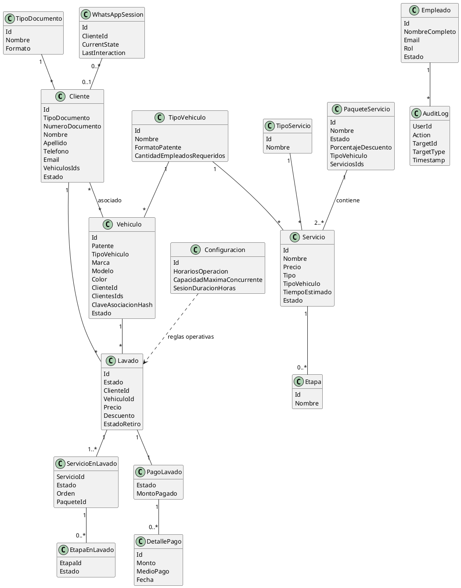

## Comportamiento del Sistema

### Diagrama de Secuencias a Nivel de Sistema (uno por cada caso de uso)

#### CU-001.1 - Iniciar sesión con correo y contraseña
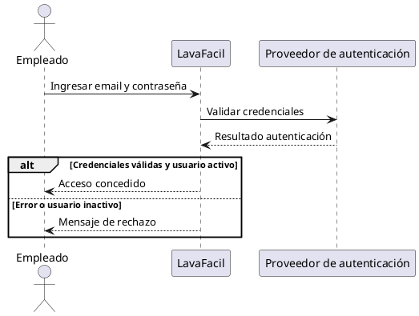

#### CU-001.2 - Iniciar sesión con Google
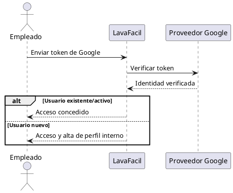

#### CU-012 - Crear cliente
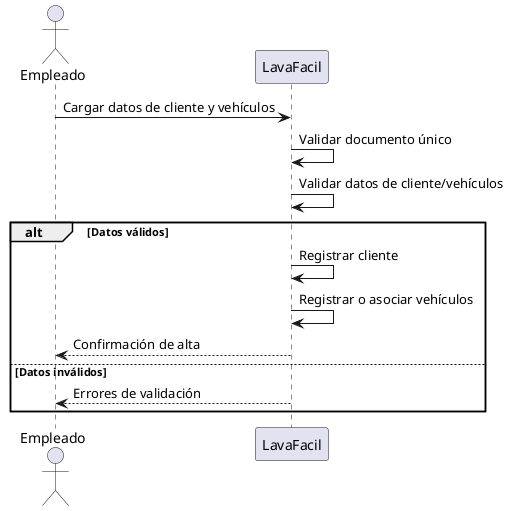

#### CU-023 - Vincular vehículo a cliente
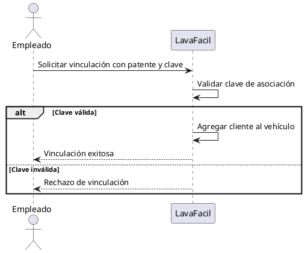

#### CU-029 - Crear servicio
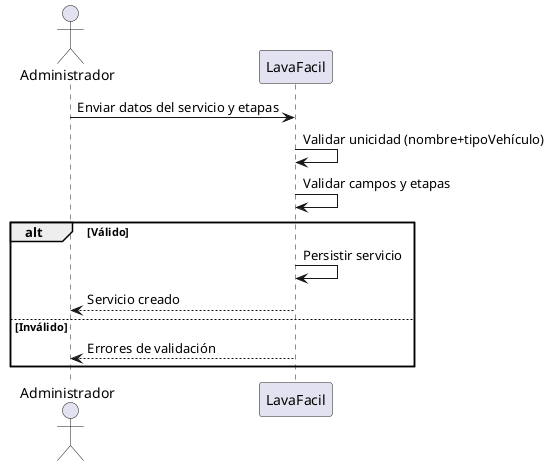

#### CU-040 - Crear paquete de servicios
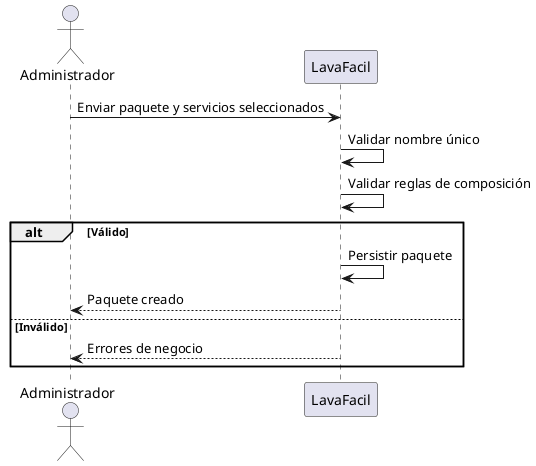

#### CU-045 - Registrar realización de un servicio (lavado)
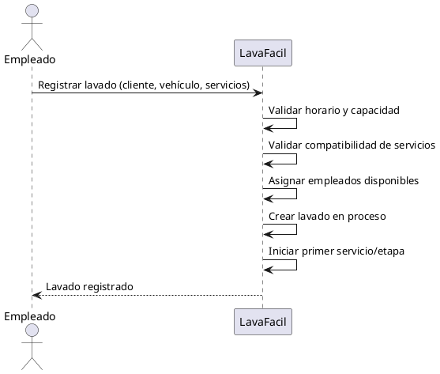

#### CU-050 - Iniciar etapa de servicio
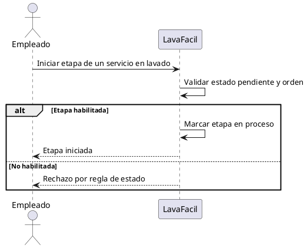

#### CU-051 - Finalizar etapa de servicio
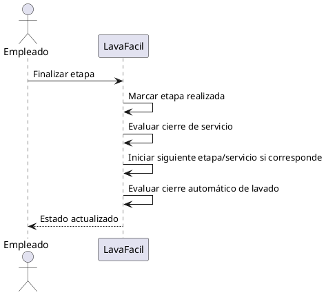

#### CU-056 / CU-057 - Registrar pago (total o parcial)
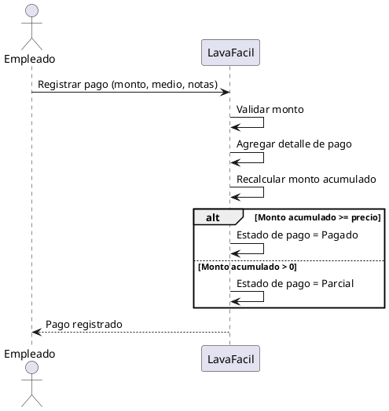

#### CU-058 - Marcar vehículo como retirado
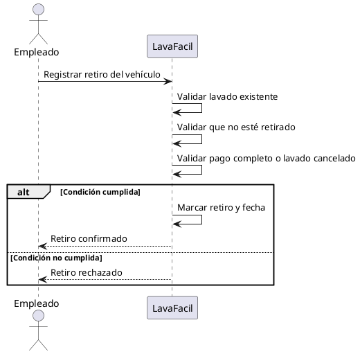

#### CU-060/061/062/063/064/065 - Configurar parámetros del lavadero
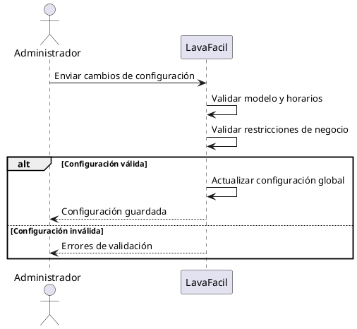

#### CU-084 - Consultar historial de auditoría
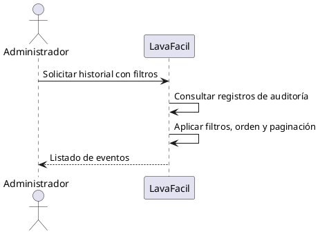

#### CU-089 - Validar webhook de WhatsApp
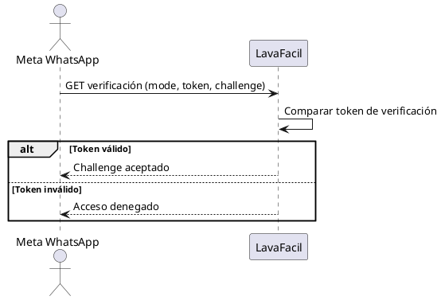

#### CU-088 / CU-090 / CU-091 / CU-092 - Procesar mensaje entrante de WhatsApp
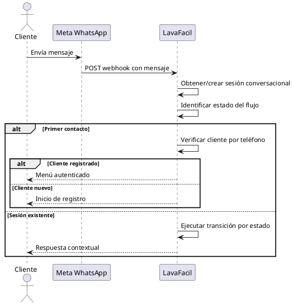

#### CU-025 / CU-026 / CU-027 / CU-028 - Registro y autogestión de cliente por WhatsApp
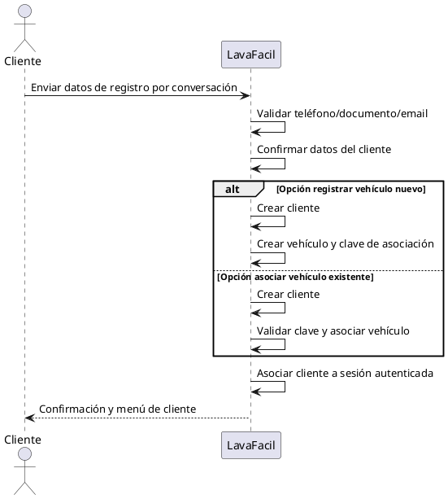

### Contratos (uno por cada caso de uso)

#### CU-001.1 - Iniciar sesión con correo y contraseña
- **Operación del sistema:** `iniciarSesionCorreo(email, password)`
- **Precondiciones:** empleado registrado y activo.
- **Postcondiciones de éxito:** sesión autenticada creada; usuario redirigido al módulo operativo.
- **Postcondiciones de error:** no se crea sesión; se informa motivo de rechazo.

#### CU-001.2 - Iniciar sesión con Google
- **Operación del sistema:** `iniciarSesionGoogle(idToken)`
- **Precondiciones:** token emitido por proveedor válido.
- **Postcondiciones de éxito:** sesión autenticada creada; perfil interno validado/creado.
- **Postcondiciones de error:** acceso denegado sin crear sesión.

#### CU-012 - Crear cliente
- **Operación del sistema:** `crearCliente(datosCliente, vehiculosData)`
- **Precondiciones:** empleado autenticado; tipos de documento disponibles.
- **Postcondiciones de éxito:** cliente activo persistido; vehículos vinculados o creados; claves de asociación generadas cuando corresponde.
- **Postcondiciones de error:** no se confirma alta; se devuelven errores de validación/duplicado.

#### CU-023 - Vincular vehículo a cliente
- **Operación del sistema:** `vincularVehiculo(clienteId, patente, claveAsociacion)`
- **Precondiciones:** cliente y vehículo activos; clave ingresada.
- **Postcondiciones de éxito:** cliente agregado a la lista de asociados del vehículo.
- **Postcondiciones de error:** vínculo no realizado por clave inválida o datos inexistentes.

#### CU-029 - Crear servicio
- **Operación del sistema:** `crearServicio(datosServicio, etapas)`
- **Precondiciones:** administrador autenticado; tipo de servicio y tipo de vehículo válidos.
- **Postcondiciones de éxito:** servicio persistido en estado activo con etapas opcionales.
- **Postcondiciones de error:** no se persiste servicio por validaciones de formato, duplicado o negocio.

#### CU-040 - Crear paquete de servicios
- **Operación del sistema:** `crearPaquete(datosPaquete, serviciosIds)`
- **Precondiciones:** administrador autenticado; servicios activos existentes.
- **Postcondiciones de éxito:** paquete persistido con servicios compatibles y descuento válido.
- **Postcondiciones de error:** paquete no creado por nombre duplicado, incompatibilidad o regla de composición.

#### CU-045 - Registrar realización de un servicio (lavado)
- **Operación del sistema:** `crearLavado(requestLavado)`
- **Precondiciones:** empleado autenticado; cliente y vehículo activos; servicios compatibles; horario operativo y capacidad disponible.
- **Postcondiciones de éxito:** lavado creado en proceso con empleados asignados, primer servicio/etapa iniciados y valores económicos calculados.
- **Postcondiciones de error:** no se crea lavado cuando falla una validación operativa o de negocio.

#### CU-050 - Iniciar etapa de servicio
- **Operación del sistema:** `iniciarEtapa(lavadoId, servicioId, etapaId)`
- **Precondiciones:** lavado y servicio existentes; etapa en estado pendiente; sin otra etapa activa incompatible.
- **Postcondiciones de éxito:** etapa en estado en proceso con tiempo de inicio registrado.
- **Postcondiciones de error:** etapa no iniciada por estado inválido o secuencia incorrecta.

#### CU-051 - Finalizar etapa de servicio
- **Operación del sistema:** `finalizarEtapa(lavadoId, servicioId, etapaId)`
- **Precondiciones:** etapa existente dentro del servicio del lavado.
- **Postcondiciones de éxito:** etapa marcada realizada; posible cierre de servicio; posible inicio automático de siguiente etapa/servicio; posible cierre automático del lavado.
- **Postcondiciones de error:** no se actualiza estado por inconsistencia de referencias.

#### CU-056 / CU-057 - Registrar pago
- **Operación del sistema:** `registrarPago(lavadoId, monto, medioPago, notas)`
- **Precondiciones:** lavado existente; monto mayor a cero.
- **Postcondiciones de éxito:** detalle de pago agregado; monto acumulado recalculado; estado de pago actualizado a parcial o pagado.
- **Postcondiciones de error:** pago no registrado por validación de monto o lavado inexistente.

#### CU-058 - Marcar vehículo como retirado
- **Operación del sistema:** `registrarRetiro(lavadoId)`
- **Precondiciones:** lavado existente; no retirado previamente; estado de pago pagado o estado de lavado cancelado.
- **Postcondiciones de éxito:** estado de retiro actualizado a retirado y fecha de retiro registrada.
- **Postcondiciones de error:** retiro rechazado por precondición incumplida.

#### CU-060/061/062/063/064/065 - Configurar parámetros del lavadero
- **Operación del sistema:** `actualizarConfiguracion(configuracion)`
- **Precondiciones:** administrador autenticado.
- **Postcondiciones de éxito:** parámetros globales persistidos e invalidados en caché de configuración.
- **Postcondiciones de error:** configuración no actualizada por formato inválido o restricción de negocio.

#### CU-084 - Consultar historial de auditoría
- **Operación del sistema:** `consultarAuditoria(filtros, orden, paginacion)`
- **Precondiciones:** administrador autenticado.
- **Postcondiciones de éxito:** registros filtrados y ordenados devueltos para visualización.
- **Postcondiciones de error:** respuesta vacía o mensaje de error sin alterar datos.

#### CU-089 - Validar webhook de WhatsApp
- **Operación del sistema:** `validarWebhook(mode, verifyToken, challenge)`
- **Precondiciones:** solicitud proveniente del proveedor de mensajería con parámetros de validación.
- **Postcondiciones de éxito:** challenge devuelto cuando token coincide.
- **Postcondiciones de error:** acceso rechazado cuando token no coincide.

#### CU-088 / CU-090 / CU-091 / CU-092 - Procesar mensaje entrante de WhatsApp
- **Operación del sistema:** `procesarMensajeWhatsApp(phoneNumber, messageBody)`
- **Precondiciones:** mensaje webhook válido.
- **Postcondiciones de éxito:** sesión conversacional creada/actualizada; transición de estado ejecutada; respuesta enviada al cliente.
- **Postcondiciones de error:** se responde de forma segura sin comprometer estado global del sistema.

#### CU-025 / CU-026 / CU-027 / CU-028 - Registro y autogestión de cliente por WhatsApp
- **Operación del sistema:** `registrarClientePorWhatsApp(sessionData)`
- **Precondiciones:** número no registrado o flujo de autogestión activo; datos conversacionales completos y válidos.
- **Postcondiciones de éxito:** cliente creado o actualizado; vehículo creado o asociado; sesión autenticada en menú de cliente.
- **Postcondiciones de error:** flujo no finalizado y sesión reiniciable para reintento.
